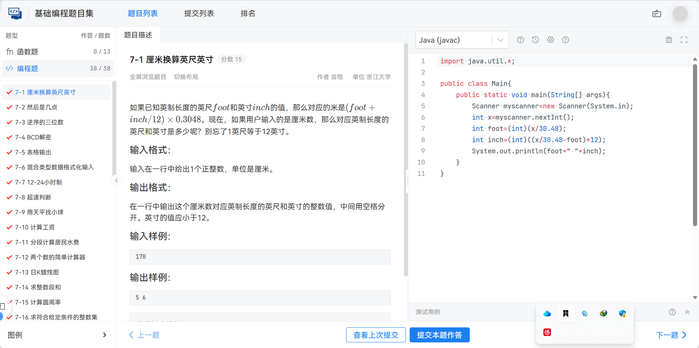
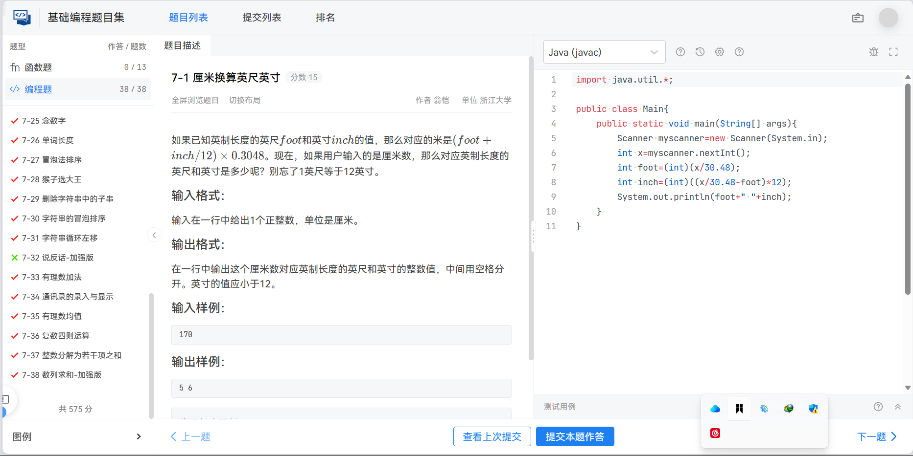
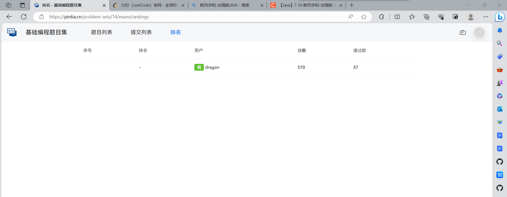
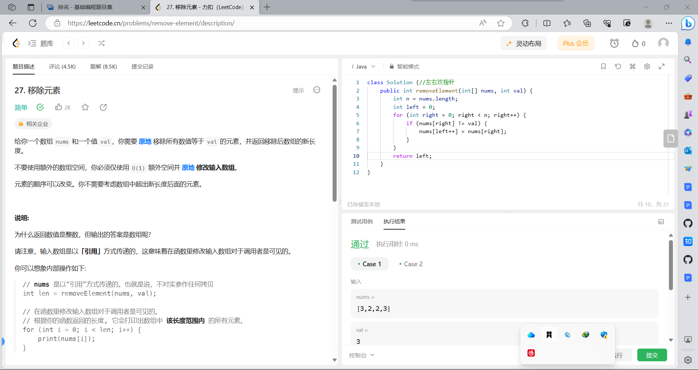
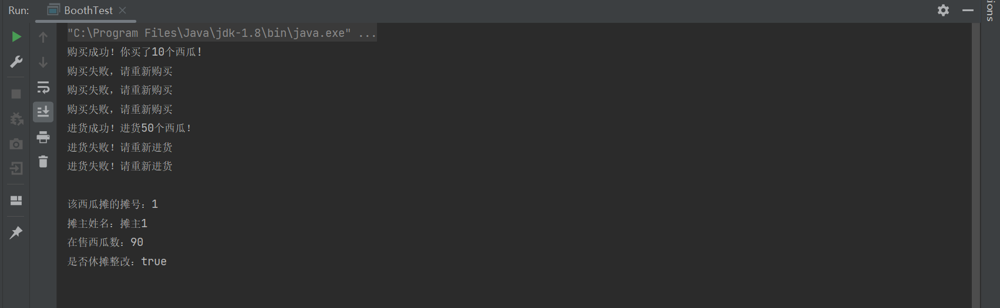

# 1.PTA的题  
  

  
~~PTA有道题的测试点一直过不去~~

# 2.LeetCode的题

参考了题解 用的左右双指针

# 3.西瓜摊   
主要学习了一下重写toString()  
主代码如下： 

```
public class Booth {
    private long id;//摊号
    private String name;//摊主姓名
    private int total;//在售西瓜数
    private boolean isClosed;//是否休摊整改

    //一个接受摊号(long)、摊主姓名(name) 、在售西瓜数(int)、是否休摊整改 (boolean)作为参数的构造方法
    public Booth(long id,String name,int total,boolean isClosed){
        this.id=id;
        this.name=name;
        this.total=total;
        this.isClosed=isClosed;
    }
    //上述变量对应的 get 和 set 方法
    public long getId() {return id;}
    public void setId(long id) {this.id = id;}
    public String getName() {return name;}
    public void setName(String name){this.name = name;}
    public int getTotal() {return total;}
    public void setTotal(int total) {this.total = total;}
    public boolean isClosed() {return isClosed;}
    public void setClosed(boolean closed) {isClosed = closed;}

    //一个重写的 toString()方法来输出 该西瓜摊的所有信息（要有一定的格式
    @Override
    public String toString() {
        return "该西瓜摊的摊号："+id+"\n"+
                "摊主姓名："+name+"\n"+
                "在售西瓜数："+total+"\n"+
                "是否休摊整改："+isClosed+"\n";
    }
    /*
    一个静态(static)方法 purchase（Booth 商家, int 购买数量）, 向目标摊位卖家 购买指定数量的西瓜。
    购买的西瓜数必须为正数；商家不能处于休摊整改状态；购买西瓜数不能大于在售西 瓜数。
    出现以上情况视为购买失败，摊主在售西瓜数不能有所变化。
    无论交易成功与否，都要输出一定的提示信息
     */
    public static void purchase(Booth booth,int num){
        if(num<=0||booth.isClosed||num> booth.total) System.out.println("购买失败，请重新购买");
        else{
            booth.setTotal(booth.getTotal()-num);
            System.out.println("购买成功！你买了"+num+"个西瓜!");
        }
    }
    //一个实例方法 restock(int 进货西瓜数),为对应摊位进货，单次进货量不能超过 200，进货失败则输出相应的提示信息。
    public void restock(int num){
        if(num<=0||num>200) System.out.println("进货失败！请重新进货");
        else{
            this.total+=num;
            System.out.println("进货成功！进货"+num+"个西瓜！");
        }
    }
    //一个静态(static)方法 closeBooths（Booth[] booths）让 booths 中所有未被休 业整改的摊位歇业(将 false 变为 true)
    // 输出已在休业整改的摊位信息（调用实例的 toString()方法）。
    public void closeBooths(Booth[] booths){
        for(Booth booth: booths){
            if(!booth.isClosed){
                booth.setClosed(true);
                System.out.println(booth.toString());
            }
        }
    }

}

```
测试代码如下：
```
public class BoothTest {
    public static void main(String[] args) {
        // 创建一些 Booth 实例用于测试
        Booth booth1 = new Booth(1, "摊主1", 50, false);
        Booth booth2 = new Booth(2, "摊主2", 100, true);

        // 测试 purchase() 方法
        Booth.purchase(booth1, 10); // 购买成功
        Booth.purchase(booth1, -5); // 购买失败，请重新购买（因为数量为负数）
        Booth.purchase(booth1, 60); // 购买失败，请重新购买（因为数量大于在售西瓜数）
        Booth.purchase(booth2, 20); // 购买失败，请重新购买（因为摊位休摊整改）
        System.out.printf("");
        // 测试 restock() 方法
        booth1.restock(50); // 进货成功
        booth1.restock(0);  // 进货失败，请重新进货（因为数量为零）
        booth1.restock(201); // 进货失败，请重新进货（因为数量超过200）
        System.out.println();
        // 测试 closeBooths() 方法
        Booth[] booths = {booth1, booth2};
        booth1.closeBooths(booths); // 将 booth2 标记为休摊整改
    }
}

```
测试结果如下：


