# 1.解题思路描述

1.1 从相关网址获取json(爬取数据)
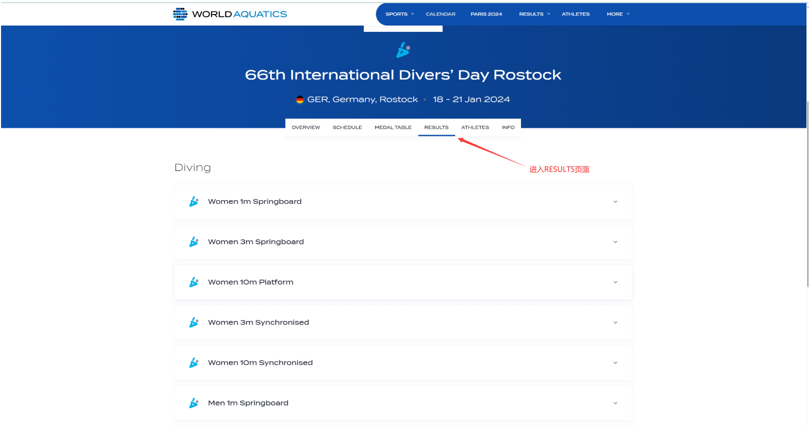

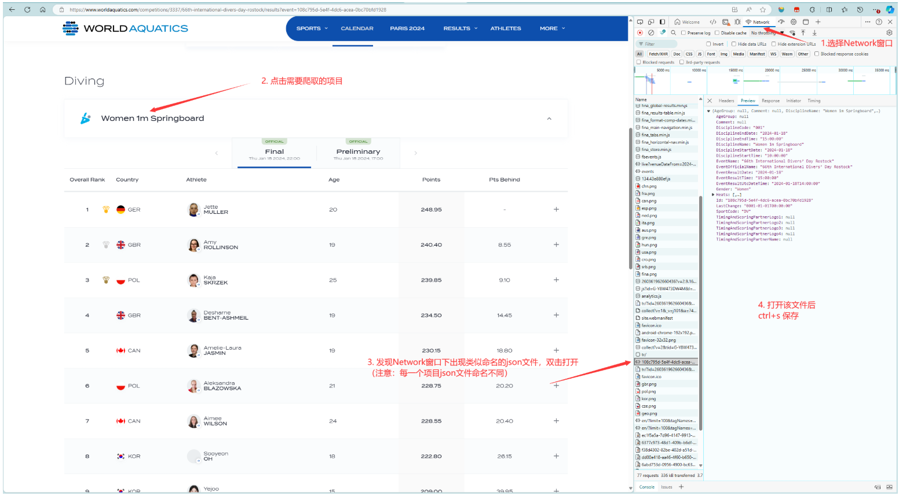
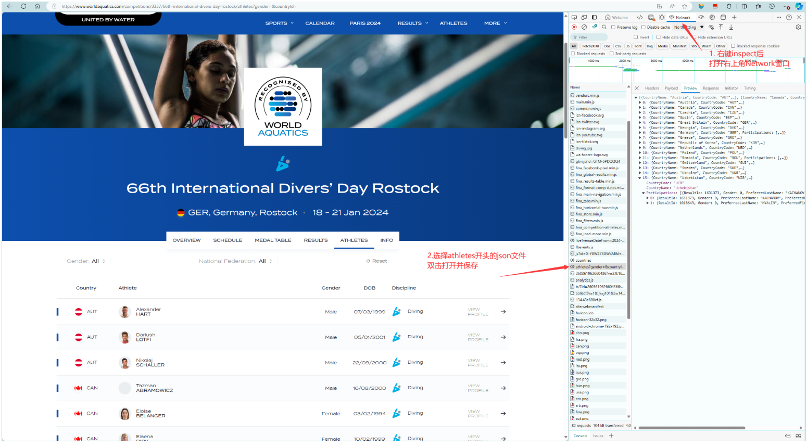
(1): : 成功爬取后获得以下数据：
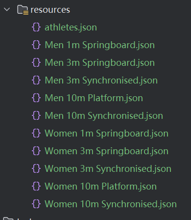

1.2 json数据解析\
1.2.1 atheletes.json解析\
可以将需要的数据分为以下的结构：
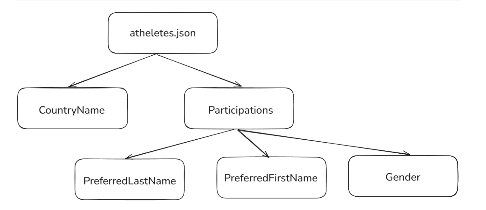
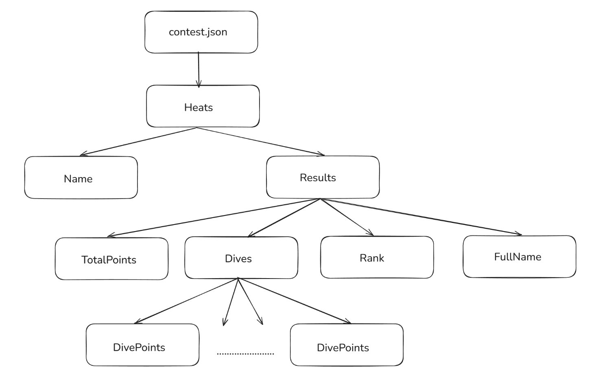
1.2.2 contest.json解析
可以将各个项目中需要的数据分为以下的结构

# 2. 接口设计和实现过程
## 2.1 JavaBean 模块
代码里分别用两个内部类放在CoreModule里面来表示比赛的结果和运动员的信息
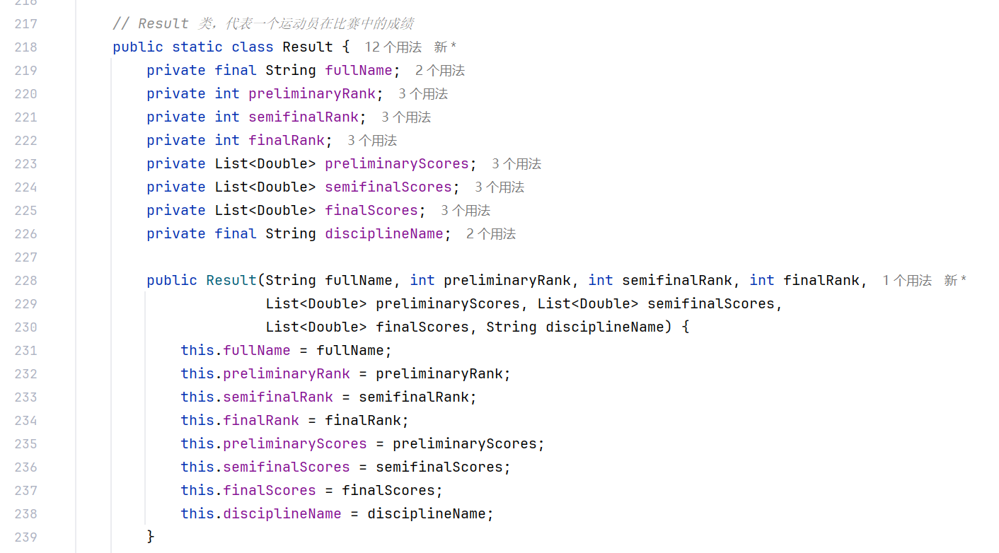
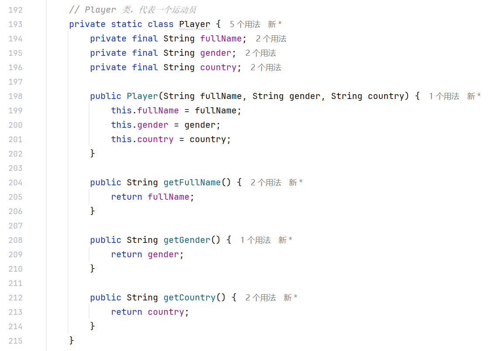
有相对应的属性以及get set 构造方法
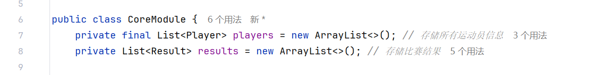
后面加载数据的时候会从JSON数据里读取对应数据并变成一个对象放在List里面
## 2.2 接口设计
### 这里设计了一个CoreModule的类来放内部类和对应需要的方法有以下几个方法
```java
//从 JSON 数据中加载运动员信息
private void loadPlayers(JsonNode athletesData){}
//这里用了jackson里面的jsonNode来读取Json文件里面的信息 分成一个一个的属性构造player对象
//因为有部分属性在文件里可能是空的做了非空判断
    String lastName 
    = participant.has("PreferredLastName") 
    && !participant.get("PreferredLastName").isNull() 
    ? participant.get("PreferredLastName").asText() 
    : "Unknown LastName";

//从 JSON 数据中加载比赛信息
public void loadContestData(JsonNode contestData){}
//就是根据数据里面的结构来一步一步获取
//调用方法:
    private List<Double> loadScores(JsonNode divesNode){}
    private Result findResultByFullName(String fullName){}
//在跳水比赛中，一个选手可能在初赛、半决赛和决赛中都参赛。
//因此，这些阶段的成绩和排名信息需要在同一个 Result 对象中进行更新
//预赛、半决赛、决赛对应的信息都要获取后面呈现再根据需求做不同的呈现
    
public String displayAllPlayersInfo(){}
//打印运动员信息

public String displayResultsForEvent(String discipline){}
//显示指定比赛项目的决赛结果
//调用方法:
    private String formatScores(List<Double> scores){}

public String displayDetailedResultsForEvent(String discipline){}
//显示指定比赛项目的详细结果（包括预赛、半决赛、决赛）
//调用方法:
    private String formatScores(List<Double> scores){}
    private String formatRank(int rank){}
//以上这几个方法都是用StringBuider来建一个输出的字符串
```
## 2.3 实现过程
就是用Maven里面的jackson这个 里面的JsonNode来读取Json里面的属性
里面的数据是有结构 以结构来读取 在封装成一个一个对象后面调用展示即可\
命令行控制端类：DWACommandLine\
用于处理命令行输入并调用核心功能模块\
## 2.4 代码展示
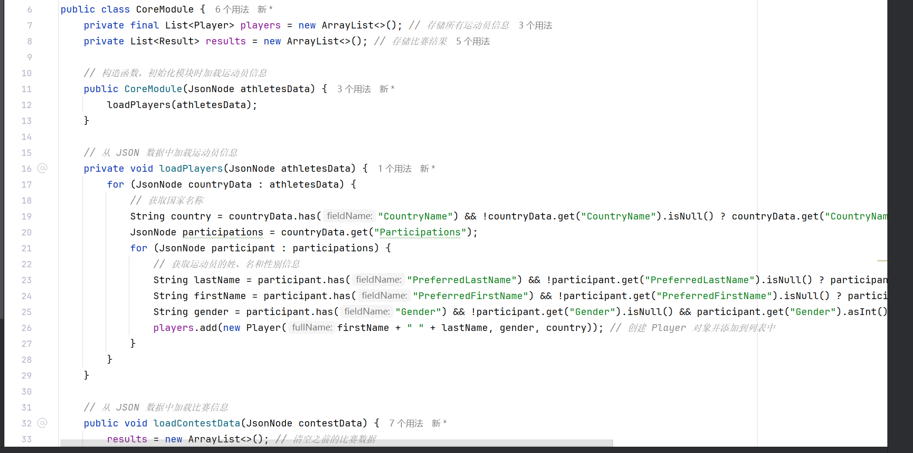
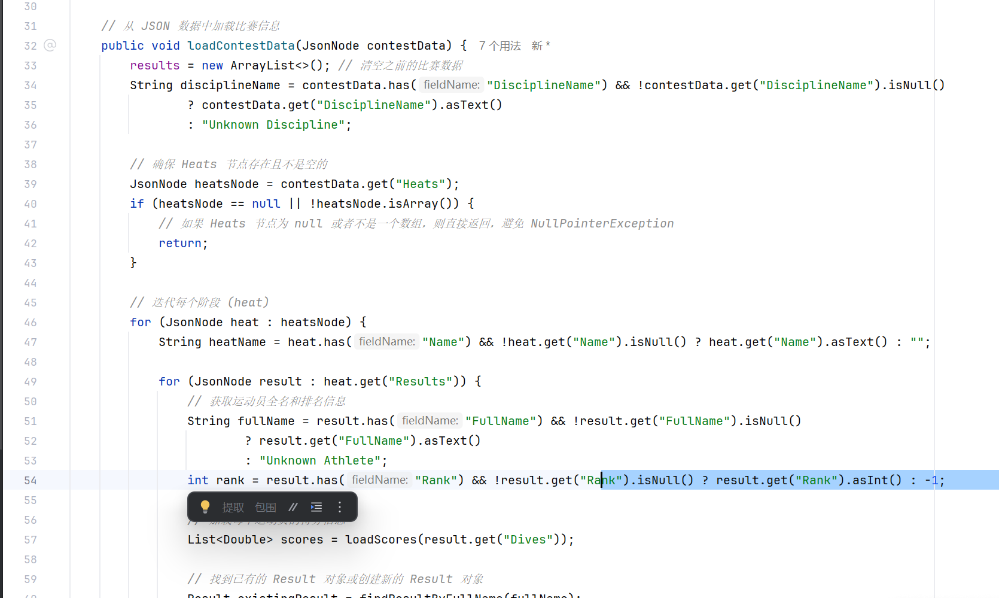


# 3. 性能改进
1. 优化 findResultByFullName 的查找
   当前你使用的是逐一遍历的方式来查找选手信息：
```java
private Result findResultByFullName(String fullName) {
for (Result result : results) {
if (result.getFullName().equalsIgnoreCase(fullName)) {
return result;
}
}
return null;
}
```
这个方法的时间复杂度是 O(n)，在处理大量选手数据时会影响性能\
改进建议：\
使用 Map<String, Result> 来替代 List<Result> 存储选手数据，这样可以通过选手的姓名作为键来快速查找对应的 Result 对象，查找时间复杂度将降低为 O(1)。\
可以将 results 由 List 改为 Map<String, Result>，然后用 fullName 作为键来查找对应的对象，这样就可以避免重复遍历整个列表。\

2.避免重复字符串拼接\
   在多个地方，你使用了 StringBuilder 进行字符串拼接，这是个不错的做法。不过在方法中多次调用 append() 来构建最终的输出字符串，也可能会影响性能，特别是在频繁的拼接操作中，StringBuilder 的扩容操作会增加不必要的开销。\
改进建议：\
确定拼接的元素个数后可以预先为 StringBuilder 分配较大的初始容量，避免扩容带来的性能损失。

3.避免不必要的空检查和类型转换
在 loadPlayers() 和 loadContestData() 方法中，你对 JsonNode 对象进行了大量的 null 检查以及类型转换：
```java
String country = countryData.has("CountryName") && !countryData.get("CountryName").isNull() ? countryData.get("CountryName").asText() : "Unknown Country";
```
问题：这些检查在较大的 JSON 数据中会导致性能损失。\
改进建议：\
如果数据格式已经相对稳定，可以使用 Optional 来简化这些操作。\
或者通过抽取公共方法来减少重复代码，从而提高代码的可读性和维护性。

# 4.单元测试
测试类是根据 CoreModule 进行编写的\
CoreModule 核心业务逻辑模块，而 DWACommandLine 主要负责输入输出和命令的解析。\
直接对包含核心逻辑的类进行单元测试

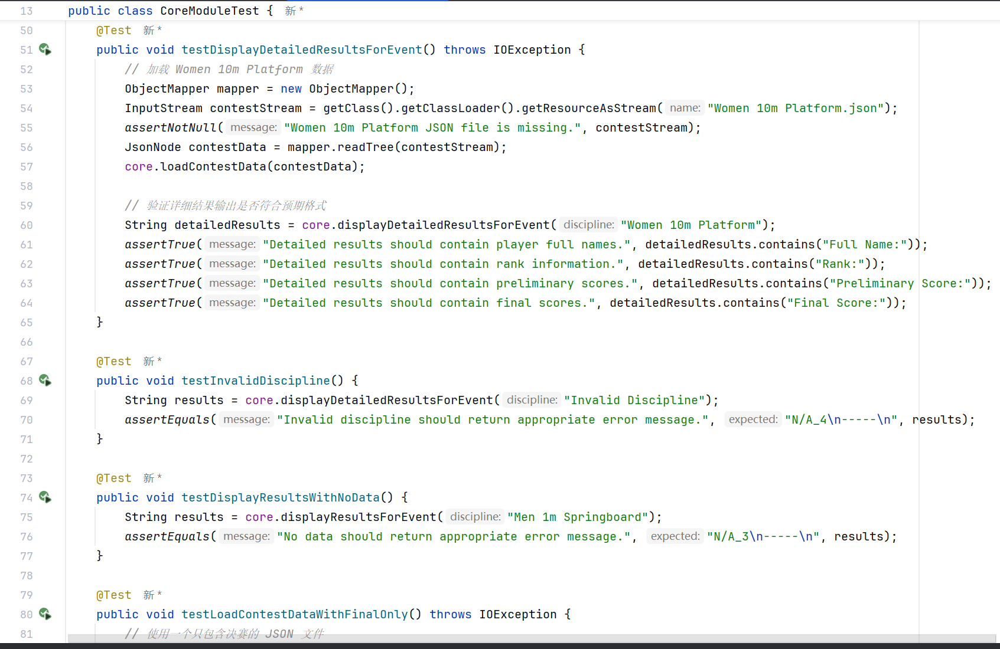
这部分了解较少 参考gpt了

# 5.异常处理
````
1. 输入数据验证和空值检查
空或缺失字段：在 JSON 文件解析时，程序通过检查节点是否为空 (isNull()) 来确保数据有效性。
空数组的处理：在 loadContestData() 方法中，增加了对 Heats 节点的空值和非数组类型检查
2.查找和更新选手数据中的异常处理
在 findResultByFullName() 方法中，如果没有找到符合条件的 Result 对象，则会返回 null。在后续调用时，会判断这个对象是否为 null，若为 null，则创建新的 Result 对象。

代码中基本依靠检查 null 或返回 -1 进行异常判断
if (eventResults.isEmpty()) {
            return "N/A_3\n-----\n"; 
        }

DWACommandLine中用try catch来处理
````

----------------------------
input
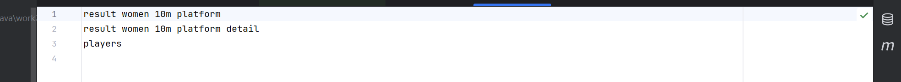
output
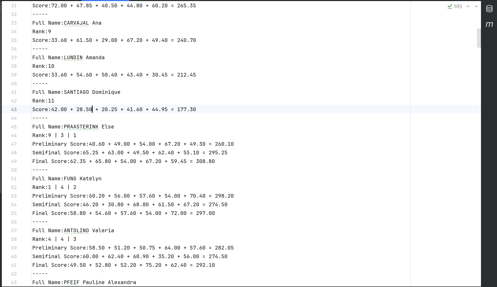
