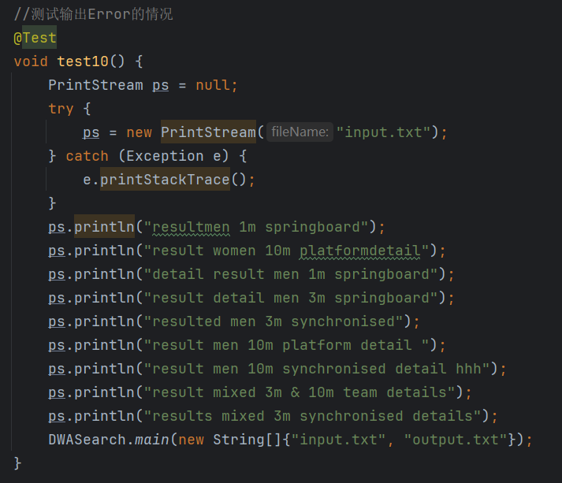
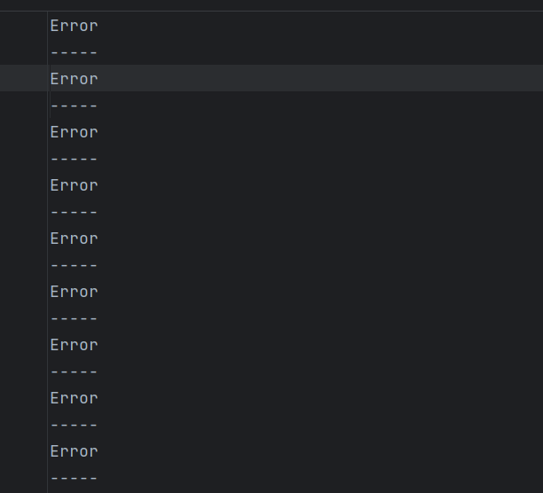
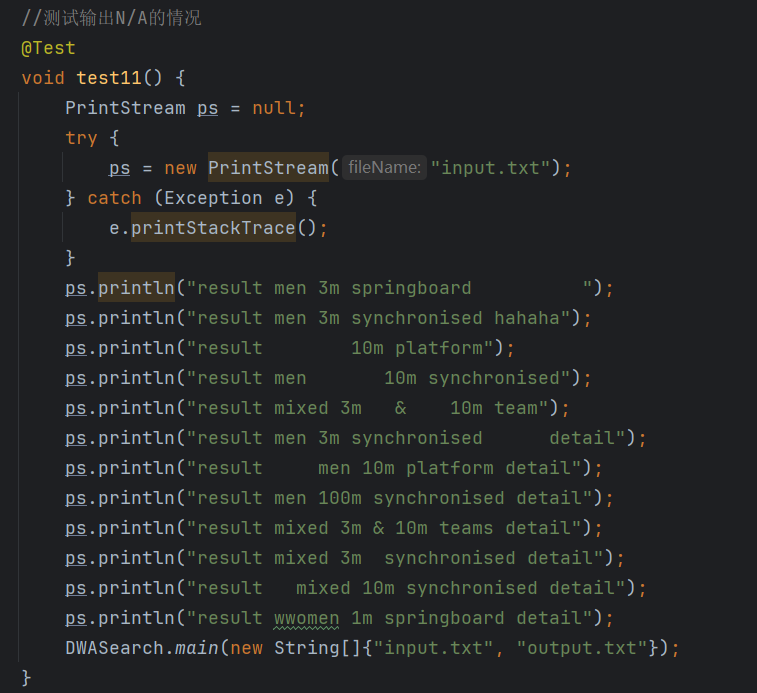
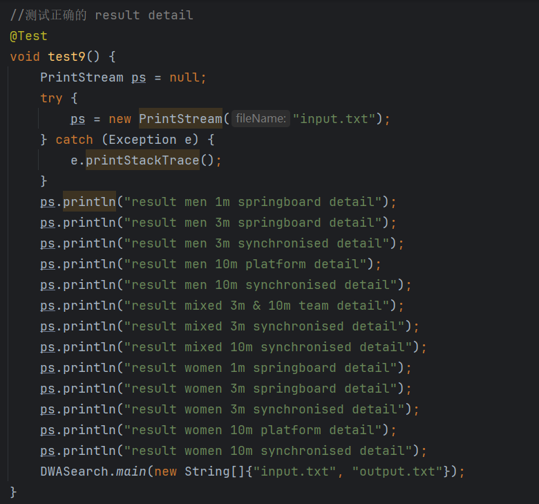
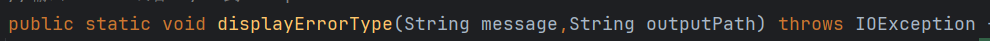
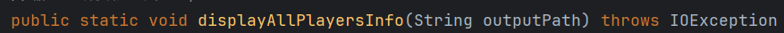
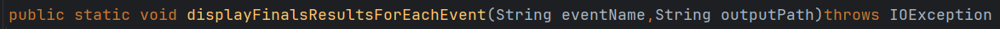
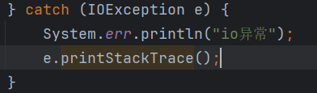

# README

# #项目名:SWASearch

# #项目功能

往cmd命令行输入Java -jar SWASearch.jar input.txt(你可指定文本文件) output.txt(同理)；

程序会根据input.txt的命令将2024世界游泳锦标赛的跳水项目信息输出到output.txt;

一行命令有3种类型：players:输出运动员信息，result 比赛项目名:输出决赛结果,result 比赛项目名 detail:输出详细结果

# #项目特性

<1>用junit进行测试

<2>用jackson进行json文件解析

<3>模块接口设计，核心功能为一个模块，方便扩展

# #设计与实现过程

maven项目，分为两个子模块，console和core_module

外部框架的依赖配置在了总项目的pom.xml

console模块的pom.xml配置了core_module的依赖

## ##core_module模块

基本功能模块，用于作为接口给其它模块依赖调用。

类分在两个包内：core_module和model

core_module包：CoreModule类

model包：用于json文件解析的目标类，Athlete,ResultShow，还有一些Athlete,ResultShow的内部类

### ###CoreModule类

核心功能类，有4个函数。

public static void displayErrorType(String message,String outputPath)：输出message到输出文件中

public static void displayAllPlayersInfo(String outputPath)：输出运动员信息到输出文件中

public static void displayFinalsResultsForEachEvent(String eventName,String outputPath)：输出比赛项目决赛结果到输出文件中

public static void displayDetailResultsForEachEvent(String eventName,String outputPath)：输出比赛项目详细结果(预赛，半决，决赛)到输出文件

关键算法：

<1>第1个函数只是将消息通过PrintStream打印出去。

<2>第2，3，4函数为了避免一个输入文件重复解析json文件，开空间将解析结果存起来了。

<3>相比函数2和3（数据相对集中，解析出来的单个信息集在一个对象中），函数4的数据在json文件中的数据相对分散，无法做到单个信息集解析出来就能在一个对象中，需要用算法实现整合信息，这里考虑用HashMap和ArrayList。具体如下：

我们先创建6个HashMap分别建立起FullName和preliminaryScore，semifinalScore，finalScore，preliminaryRank，semifinalRank，

​`finalRank`的关系(至于为啥不将后面那6个数据封装起来只用一个HashMap来映射，还是因为数据较分散，虽然也是可以的，但是

要在HasdMap中先找到FullName指向的对象，再对对象进行设置值操作。所以我比较偏向不封装)。在有了6个关系之后，根据要求，需要按照第一个比赛的排名进行排序，所以我创建了一个HashMap firstRank,从preliminaryRank，semifinalRank，finalRank,指向第一个非空map的引用

然后将firstRank的键(FullName)和值(Rank)封装(CoreModule的内部类NameAndRank)添加进一个ArrayList中,然后调用sort方法指定根据rank排序，再通过6个HashMap就得到了一个信息集。

### ###Athlete类

选手信息的目标类

### ###ResultShow类

结果信息的目标类

## ##console模块

cmd命令行模块，依赖core_module模块，主要有DWASearch类，DWASearchTest类。

### ###DWASearch类

cmd程序的入口（主类），只有一个main函数，判断输入的参数是否合规和读取输入文件并分析命令类型

### ###DWASearchTest类

测试类，用junit测试框架设计测试类

‍

‍

‍

‍

## 

‍

‍

# #部分单元测试展示

# #异常处理

遵循及早抛出，延迟捕获原则

以上基本功能函数直接抛出异常，交由调用者捕获处理

调用者捕获异常，向用户说明异常原因。

‍
