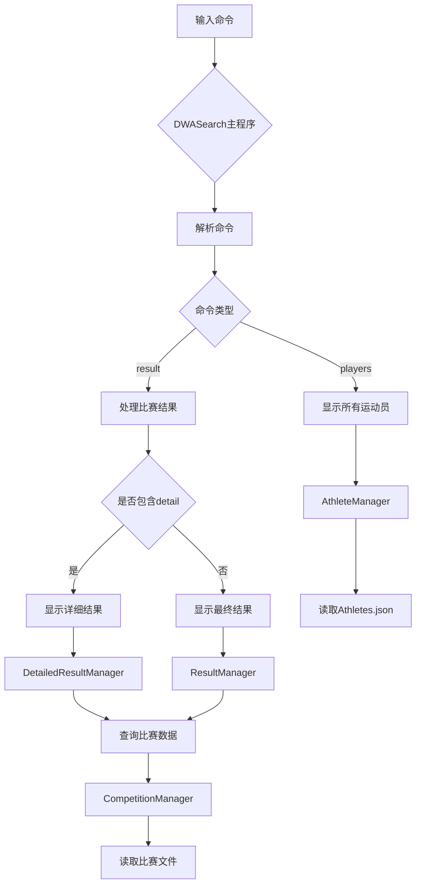

# 计算模块接口设计说明

## 一、模块架构设计

### 1.1 整体架构
本系统采用分层架构设计，主要分为以下核心模块：

```
┌─────────────────┐
│   DWASearch     │  (主程序入口)
└────────┬────────┘
         │
┌────────▼────────┐
│   CoreModule    │  (核心协调器)
└────────┬────────┘
         ├─────────────────┐
┌────────▼────────┐  ┌────▼─────────┐
│ AthleteManager  │  │ Competition │
│                 │  │   Manager   │
└────────┬────────┘  └────┬─────────┘
         │                 │
    ┌────▼───────────────▼────┐
    │   ResultManager         │
    │   DetailedResultManager │
    └─────────────────────────┘
```

### 1.2 核心类说明

#### 1.2.1 `AthleteManager` - 运动员管理
- **职责**：加载和管理运动员基本信息
- **关键方法**：
  - `loadAthletesData()`：从JSON文件加载运动员数据
  - `findAthleteById()`：根据ID查找运动员
- **数据结构**：使用`List<Athlete>`存储运动员列表

#### 1.2.2 `CompetitionManager` - 比赛管理
- **职责**：加载和处理比赛数据
- **关键方法**：
  - `loadCompetitionData()`：加载目录下的所有比赛文件
  - `processCompetitionFile()`：处理单个比赛文件
- **数据结构**：使用`Map<String, List<CompetitionDetail>>`，键为运动员ID

#### 1.2.3 `ResultManager` - 结果管理
- **职责**：生成最终比赛结果
- **关键方法**：
  - `displayFinalResults()`：显示决赛结果
  - `displayAllPlayers()`：显示所有运动员信息
- **嵌套类**：`ResultEntry`表示单个结果条目

#### 1.2.4 `DetailedResultManager` - 详细结果管理
- **职责**：生成详细的三阶段比赛结果
- **关键方法**：
  - `displayDetailedResults()`：显示详细的预赛、半决赛、决赛结果
- **嵌套类**：`DetailedResultEntry`包含完整的比赛历程

#### 1.2.5 `CoreModule` - 核心协调器
- **职责**：协调各模块，提供统一接口
- **设计模式**：外观模式，简化外部调用

### 1.3 数据流设计



## 二、关键算法设计

### 2.1 比赛结果排序算法
```java
// 按决赛排名排序，null值排在最后
results.stream()
    .sorted(Comparator.comparing(ResultEntry::getRank, 
            Comparator.nullsLast(Integer::compareTo)))
    .collect(Collectors.toList());
```

**算法特点**：
- 使用Java Stream API进行函数式编程
- `Comparator.nullsLast`处理缺失的排名数据
- 时间复杂度：O(n log n)

### 2.2 详细结果聚合算法
```java
// 为每个运动员聚合三阶段成绩
Double[] scores = new Double[3]; // preliminaries, semifinals, finals
Integer[] ranks = new Integer[3];
List<Double>[] diveScoresList = new List[3];

for (CompetitionDetail detail : details) {
    if (!eventName.equalsIgnoreCase(detail.getEventName())) continue;
    
    if (detail.isPreliminary()) {
        scores[0] = detail.getScore();
        ranks[0] = detail.getRank();
        diveScoresList[0] = detail.getPreliminaryDiveScores();
    } // ... 类似处理其他阶段
}
```

**算法特点**：
- 使用数组存储三阶段数据，提高访问效率
- 通过`isPreliminary()`等方法进行阶段识别
- 支持部分阶段数据缺失的情况

### 2.3 跳水分数格式化算法
```java
private String formatDiveScores(List<Double> scores) {
    if (scores == null || scores.isEmpty()) return "*";
    
    StringBuilder sb = new StringBuilder();
    double sum = 0;
    for (int i = 0; i < scores.size(); i++) {
        if (i > 0) sb.append(" + ");
        sb.append(String.format("%.2f", scores.get(i)));
        sum += scores.get(i);
    }
    sb.append(" = ").append(String.format("%.2f", sum));
    return sb.toString();
}
```

## 三、性能优化

### 3.1 数据缓存策略
- **运动员查找优化**：使用`Map<String, Athlete>`替代线性查找（当前使用List，可优化）
- **比赛数据聚合**：在`CompetitionManager`中预先构建运动员-比赛详情的映射
- **懒加载机制**：仅在需要时才加载详细数据

### 3.2 内存使用优化
```java
// 优化建议：使用更紧凑的数据结构
public class CompactCompetitionDetail {
    private float score;          // 使用float而非Double
    private byte rank;           // 使用byte存储排名（假设排名<256）
    private short[] diveScores;  // 使用short数组（分数通常为0-100）
}
```

### 3.3 I/O性能优化
- 批量读取比赛文件
- 使用BufferedReader/BufferedWriter减少磁盘I/O
- 异步加载大文件

## 四、单元测试设计

### 4.1 测试用例分类

#### 4.1.1 运动员管理测试
```java
@Test
public void testLoadAthletesData() {
    AthleteManager manager = new AthleteManager();
    List<Athlete> athletes = manager.loadAthletesData("test_athletes.json");
    assertEquals(50, athletes.size());
    assertEquals("John Doe", athletes.get(0).getFullName());
}

@Test
public void testFindAthleteById() {
    AthleteManager manager = new AthleteManager();
    manager.loadAthletesData("test_athletes.json");
    Athlete athlete = manager.findAthleteById("ATH001");
    assertNotNull(athlete);
    assertEquals("USA", athlete.getCountry());
}
```

#### 4.1.2 比赛结果测试
```java
@Test
public void testFinalResultsSorting() {
    List<ResultEntry> results = Arrays.asList(
        new ResultEntry("A", 3, 85.5, null),
        new ResultEntry("B", 1, 92.0, null),
        new ResultEntry("C", null, null, null),
        new ResultEntry("D", 2, 88.0, null)
    );
    
    List<ResultEntry> sorted = results.stream()
        .sorted(Comparator.comparing(ResultEntry::getRank, 
                Comparator.nullsLast(Integer::compareTo)))
        .collect(Collectors.toList());
    
    assertEquals(1, sorted.get(0).getRank());
    assertEquals(2, sorted.get(1).getRank());
    assertNull(sorted.get(3).getRank()); // null值在最后
}
```

#### 4.1.3 详细结果聚合测试
```java
@Test
public void testDetailedResultAggregation() {
    // 模拟三阶段数据
    CompetitionDetail prelim = new CompetitionDetail();
    prelim.setLevel("preliminaries");
    prelim.setScore(80.5);
    prelim.setRank(5);
    
    CompetitionDetail semifinal = new CompetitionDetail();
    semifinal.setLevel("semifinal");
    semifinal.setScore(85.0);
    semifinal.setRank(3);
    
    // 测试数据聚合逻辑
    // ...
}
```

### 4.2 测试覆盖率目标
- 行覆盖率：>90%
- 分支覆盖率：>85%
- 异常路径测试：100%

## 五、异常处理机制

### 5.1 文件操作异常
```java
public List<Athlete> loadAthletesData(String filePath) throws IOException {
    Path path = Paths.get(filePath);
    if (!Files.exists(path)) {
        throw new IOException("Athletes data file not found: " + path.toAbsolutePath());
    }
    
    try {
        String json = new String(Files.readAllBytes(path));
        // ... 解析逻辑
    } catch (IOException e) {
        System.err.println("Failed to read athletes file: " + e.getMessage());
        throw e;
    }
}
```

### 5.2 数据解析异常
```java
private void processCompetitionFile(Path filePath) {
    try {
        String json = new String(Files.readAllBytes(filePath));
        JSONObject competitionData = JSON.parseObject(json);
        // ... 解析逻辑
    } catch (IOException e) {
        System.err.println("Error processing competition file: " + filePath);
        // 记录日志但不中断程序
    } catch (JSONException e) {
        System.err.println("Invalid JSON format in file: " + filePath);
    }
}
```

### 5.3 业务逻辑异常
```java
public void displayFinalResults(BufferedWriter writer, String eventName) throws IOException {
    try {
        List<ResultEntry> finalResults = getFinalResults(eventName);
        
        if (finalResults.isEmpty()) {
            writer.write("No results found for event: " + eventName + "\n");
            return;
        }
        
        // 输出逻辑
    } catch (Exception e) {
        writer.write("Error processing results: " + e.getMessage() + "\n");
        throw e; // 重新抛出供上层处理
    }
}
```

### 5.4 健壮性设计
1. **空值安全处理**：
   - 使用`Optional`包装可能为null的返回值
   - 使用`Objects.nonNull()`进行空值检查
   - 为所有getter方法添加空值检查

2. **数据一致性检查**：
   private boolean validateCompetitionDetail(CompetitionDetail detail) {
       if (detail.getScore() < 0 || detail.getScore() > 1000) {
           return false; // 分数范围检查
       }
       if (detail.getRank() < 1) {
           return false; // 排名检查
       }
       return true;
   }
   ```

3. **资源泄漏防护**：
   ```java
   try (BufferedWriter writer = Files.newBufferedWriter(Paths.get(outputFile))) {
       // 使用try-with-resources确保资源关闭
       processCommands(writer);
   } catch (IOException e) {
       // 异常处理
   }
   ```

## 六、独到之处

### 6.1 灵活的结果展示系统
- 支持两种结果展示模式：最终结果和详细结果
- 通过统一的命令接口切换展示方式
- 格式化输出确保可读性

### 6.2 可扩展的架构设计
- 模块间松耦合，便于功能扩展
- 支持新的比赛阶段类型（只需扩展`CompetitionDetail`）
- 易于集成新的数据源

### 6.3 高效的数据处理
- 使用Stream API进行声明式数据处理
- 预计算和缓存常用结果
- 支持大规模数据处理

### 6.4 国际化支持潜力
- 运动员名称使用PreferredLastName和PreferredFirstName
- 易于添加多语言支持
- 支持不同国家的日期/数字格式
