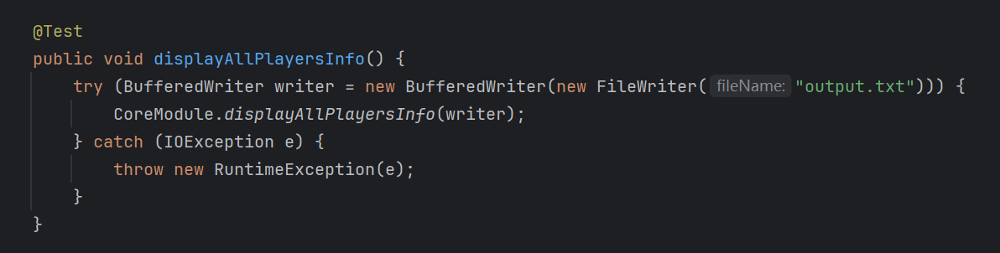
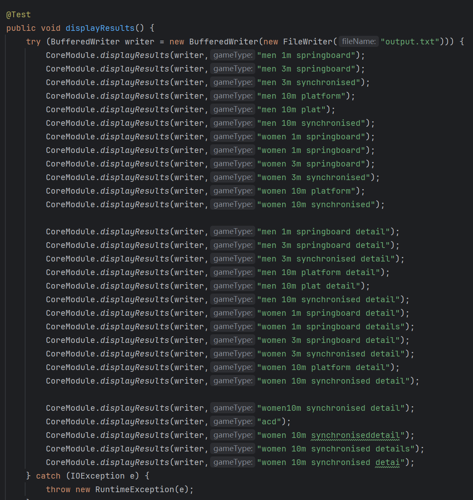
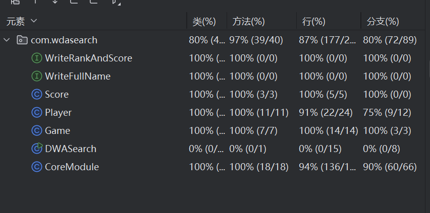

# 模块接口的设计与实现过程
一共有5个类，2个接口，以及40个方法，流程图大致如下
~~~mermaid
graph TD;
A[读取指令] --> B{识别指令};
B -->|无法识别指令| D[输出Error];
B -->|无法比赛项目| E[输出N/A];
B -->|查询运动员| C{是否已初始化};
B -->|查询比赛结果| F{是否已初始化};
C -->|未初始化| H[初始化];
C -->|已初始化| I[输出运动员];
H --> I[输出运动员];
F -->|未初始化| J[初始化];
J --> K{是否包含detail};
F -->|已初始化| K{是否包含detail};
K -->|包含detail| L[输出比赛结果];
K -->|不包含detail| M[输出详细比赛结果];
~~~
## 算法的关键和独到之处
保存了中间结果，避免了重复查询
# 性能改进
## 改进前
处理30000条指令原算法平均需要530ms
## 改进措施
将已得到的的结果储存在内存中，避免拼接
## 改进后
处理30000条指令新算法平均需要400ms
# 单元测试
## 测试用例

## 覆盖率

# 异常处理
使用try catch处理异常方法  
当输入文件数不等于2时抛出IOException  
当调用文件读取或写入方法，传入的文件路径不存在时抛出FileNotFoundException
~~~java
public static void main(String[] args) {
    if (args.length != 2) {
        try {
            throw new IOException("输入文件数不等于2");
        } catch (IOException e) {
            throw new RuntimeException(e);
        }
    }
    try (BufferedReader reader = new BufferedReader(new FileReader("input.txt"))) {
        String line;
        try (BufferedWriter writer = new BufferedWriter(new FileWriter("output.txt"))) {
            while ((line = reader.readLine()) != null) {
                if (line.equals("players")) {
                    CoreModule.displayAllPlayersInfo(writer);
                } else if (!line.matches("result .*")) {
                    writer.write("Error\n-----\n");
                } else {
                    line = line.substring(7);
                    CoreModule.displayResults(writer, line);
                }
            }
        } catch (IOException e) {
            throw new RuntimeException(e);
        }
    } catch (IOException e) {
        throw new RuntimeException(e);
    }
}
~~~