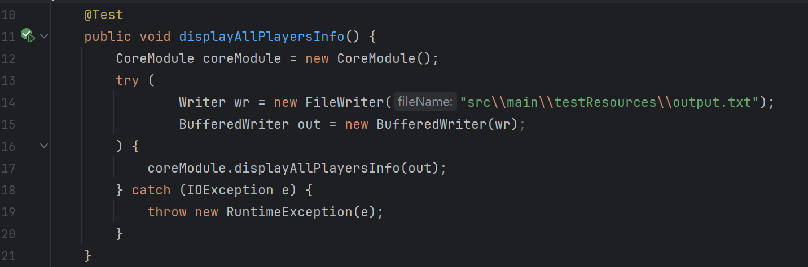
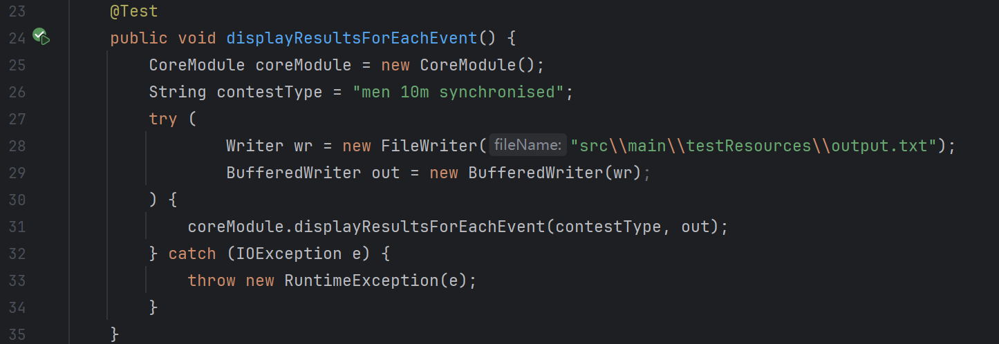
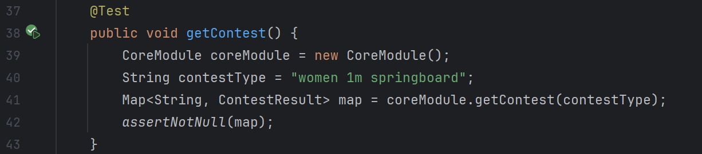
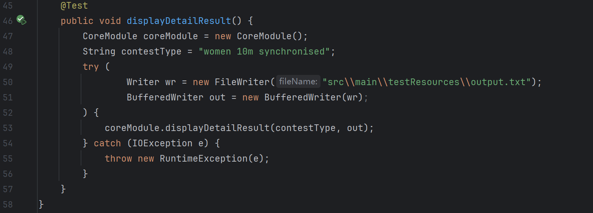

# 1. 爬取数据

打开网站后进入开发者模式，然后按下图步骤找到文件后，双击并下载。

# 2. 模块接口设计与实现过程

## 数据分析

需要记录运动员**信息**（名字，国籍，性别），运动员在**不同赛程**中的**排名及得分情况**。

1. 创建``Athlete``类来记录运动员状况；
2. ``ScheduleDetail``类记录单个赛程中运动员的得分及排名状况。由于发现男子和女子比赛中评分数不同，使用``ArrayList``类型来记录评委分数；
3. ``ContestResult``类特定运动员的第一次比赛成绩、决赛比赛成绩（如果有），并包含了一个``HashMap<String, ScheduleDetail>``来记录不同赛程的运动员得分及排名状况。


## 方法实现

使用``CoreModule``类用来实现基本功能，并实现了下列四个方法。

### ``getContest``

```java
public Map<String, ContestResult> getContest(String contestType)
```

该方法能够读取json文件并反序列化，将``ContestResult``存放到以选手姓名为索引的哈希表中。并返回该哈希表。


### ``displayAllPlayersInfo``

```java
public void displayAllPlayersInfo(BufferedWriter out) //将所有运动员的信息输出到指定文件。
```

文件中已经按照规定顺序排序，直接格式化输出。


### ``displayResultsForEachEvent``

```java
//将指定比赛类型的比赛决赛结果输出到指定文件。
public void displayResultsForEachEvent(String contestType, BufferedWriter bw) 
```

将接受到的``HashMap``首先转换为``ArrayList``，随后再利用``Compartor``将该``ArrayList``按照``FinalRank``排序，并进行后续格式化输出。


### ``displayDetailResult``

```java
//将指定比赛类型的比赛详细结果输出到指定文件。
public void displayDetailResult(String contestType, BufferedWriter bw)
```

将接受到的``HashMap``首先转换为``ArrayList``，随后再利用``Compartor``将该``ArrayList``按照``FirstRank``排序，并进行后续格式化输出。


# 3. 性能改进

## 文件读取

使用了字符缓冲流，从而加快字符读取速度。

## 存放数据

使用``HashMap``以姓名为key存放``ContestResult``，并以赛制名称为key存放``ScheduleDetail``。提高了存取效率。

## 代码复用

获得``HashMap<String, ScheduleDetail>``的操作会频繁使用，所以提取至``getContest``，提高了代码复用性。


# 4. 单元测试

## ``CoreModule``









# 5. 异常处理

1. 使用try-catch包裹涉及IO处理的代码。
2. 在``main``函数中声明了自定义异常``FileNumberError``，用来对应命令行运行时输入错误数量文件时的情况。


