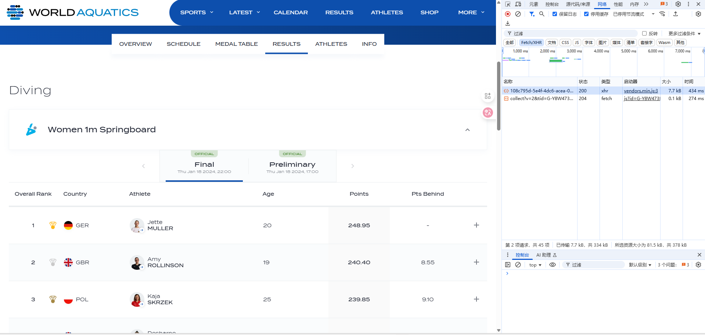
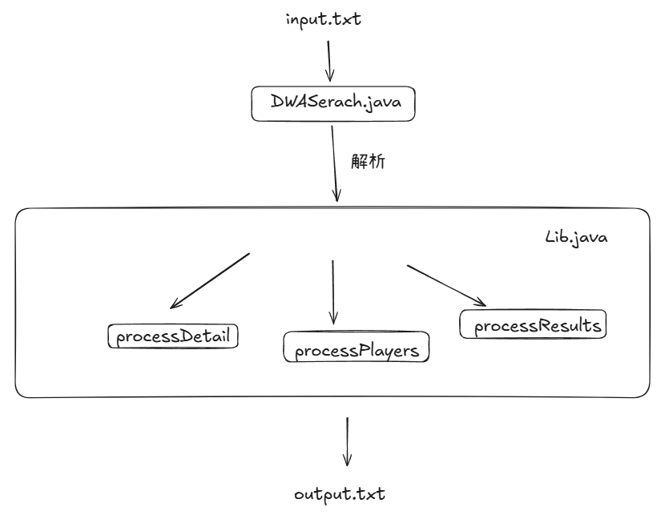
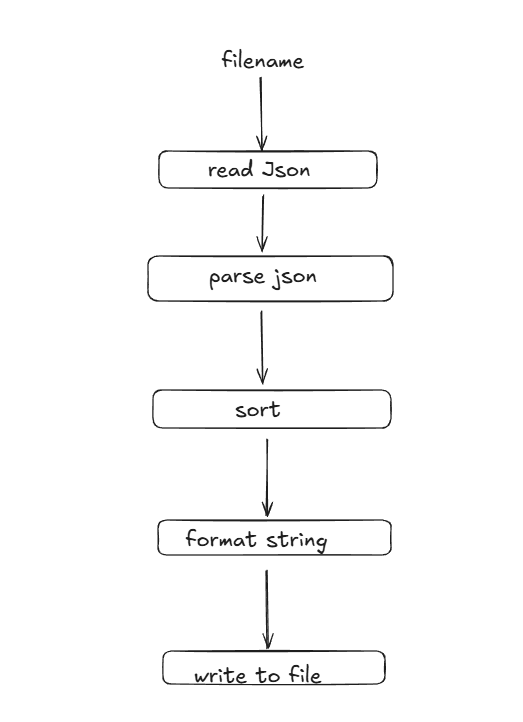

## 1.数据收集

打开开发者工具(F12)，点击要获取的资源，开发者工具中勾选 Fetch/XHR，然后对这些 URL 发起 GET 请求即可得到返回的 Json， 然后进行数据清理，只留下需要的字段。
这里以获取选手信息为例：
```golang
    import (
        "encoding/json"
        "fmt"
        "log"
        "net/http"
        "os"
    )

    type Response struct {
        Participations []Participation `json:"Participations"`
    }

    type Participation struct {
        PreferredLastName  string `json:"PreferredLastName"`
        PreferredFirstName string `json:"PreferredFirstName"`
        NAT                string `json:"NAT"`
        Gender             int    `json:"Gender"`
        PersonId           string `json:"PersonId"`
    }

    type output struct {
        FullName string `json:"FullName"`
        Gender   string `json:"Gender"`
        Country  string `json:"Country"`
        LastName string `json:"LastName"`
    }

    func main() {
        url := "https://api.worldaquatics.com/fina/competitions/3337/athletes?gender=&countryId="
        resp, err := http.Get(url)
        if err != nil {
            log.Fatalf("Failed to fetch data: %v", err)
        }
        defer resp.Body.Close()

        var responses []Response
        if err := json.NewDecoder(resp.Body).Decode(&responses); err != nil {
            log.Fatalf("Failed to decode JSON: %v", err)
        }

        var outputs []output
        for _, response := range responses {
            for _, p := range response.Participations {
                fullName := fmt.Sprintf("%s %s", p.PreferredFirstName, p.PreferredLastName)
                genderStr := ""
                if p.Gender == 1 {
                    genderStr = "Female"
                } else {
                    genderStr = "Male"
                }
                outputs = append(outputs, output{
                    FullName: fullName,
                    Gender : genderStr,
                    Country:  p.NAT,
                    LastName: p.PreferredLastName,
                })
            }
        }

        file, err := os.Create("athletes.json")
        if err != nil {
            log.Fatalf("Failed to create file: %v", err)
        }
        defer file.Close()

        encoder := json.NewEncoder(file)
        encoder.SetIndent("", "  ")
        if err := encoder.Encode(outputs); err != nil {
            log.Fatalf("Failed to write JSON to file: %v", err)
        }

        fmt.Println("Data successfully written to athletes.json")
    }
```
## 2.设计与实现过程

大致流程就是逐行读取 input.txt 中的指令，根据对应的指令调取   Lib.java 的方法输出到 output.txt 中。


共通的 process 函数处理过程就是：
- 读入 Json
- 反序列化 Json 为对象列表
- 排序对象列表
- 格式化输出
- 写入文件

本作业采用 Jackson 反序列化 Json 文件，
采用 PrintWriter 类来追加写入，
采用 InputStream 类正确加载 Json 文件路径

## 3. 性能改进
- 对 Json 文件进行数据清洗，增强了 IO 性能
- 利用 StringBuilder 类格式化输出，一次性写入到文件中， 减少 IO 开销

## 4. 单元测试
为了方便单元测试，我将 Lib.java 中的辅助函数设为 package-private 权限，并且将主函数流程拆分成多个子函数。
```java
   ……
       @Test
    void testSortDetail() {
        List<ResultDetail> details = new ArrayList<>();
        details.add(new ResultDetail("B", "2", "1", "3", "1.0 + 2.0 + 3.0 = 6.0",
                "1.0 + 2.0 + 3.0 = 6.0", "1.0 + 2.0 + 3.0 = 6.0"));
        details.add(new ResultDetail("A", "1" ,"2", "3", "1.0 + 2.0 + 3.0 = 6.0",
                "1.0 + 2.0 + 3.0 = 6.0", "1.0 + 2.0 + 3.0 = 6.0"));
        details.add(new ResultDetail("C", "3", "2" ,"1" , "1.0 + 2.0 + 3.0 = 6.0",
                "1.0 + 2.0 + 3.0 = 6.0", "1.0 + 2.0 + 3.0 = 6.0"));
        Lib.sortDetail(details);
        for (int i = 0; i < details.size() - 1; i++) {
            ResultDetail current = details.get(i);
            ResultDetail next = details.get(i + 1);
            int currentPrelimRank = Integer.parseInt(current.getPreliminaryRank());
            int nextPrelimRank = Integer.parseInt(next.getPreliminaryRank());
            Assertions.assertTrue(currentPrelimRank <= nextPrelimRank);
        }
    }

    /**
     * 测试 Lib.formatDetail 方法中的拼接是否符合格式
     */
    @Test
    void testFormatDetail() {
        String expectedOutput = """
                Full Name:Alexander HART
                Rank:1 | 2 | 3
                Preliminary Score:1.0 + 2.0 + 3.0 = 6.0
                Semifinal Score:1.0 + 2.0 + 3.0 = 6.0
                Final Score:1.0 + 2.0 + 3.0 = 6.0
                -----
                """;
        List<ResultDetail> details = new ArrayList<>();
        details.add(new ResultDetail("Alexander HART", "1", "2", "3",
                "1.0 + 2.0 + 3.0 = 6.0",
                "1.0 + 2.0 + 3.0 = 6.0",
                "1.0 + 2.0 + 3.0 = 6.0"));
        String output = Lib.formatDetail(details);
        Assertions.assertEquals(expectedOutput, output);
    }

    /**
     * 测试 Lib.fillDetail 方法中的填充逻辑
     */
    @Test
    void testFillDetail() {
        List<ResultDetail> details = new ArrayList<>();
        InputStream stream = getClass().getClassLoader().getResourceAsStream(TEST_RESULT_JSON);
        List<Result> results = Lib.parseResults(stream);
        Lib.fillDetail(details, results);
        Assertions.assertEquals(2, details.size());
    }

    /**
     * 测试 Lib.formatDetail 方法中的处理空排名与空比赛的逻辑
     */
    @Test
    void testFormatDetailWithEmptyValues() {
        String expectedOutput = """
                Full Name:John DOE
                Rank:* | * | 1
                Preliminary Score:*
                Semifinal Score:*
                Final Score:1.0 + 2.0 + 3.0 = 6.0
                -----
                """;
        List<ResultDetail> details = new ArrayList<>();
        details.add(new ResultDetail("John DOE", "", "", "1",
                null, "", "1.0 + 2.0 + 3.0 = 6.0"));
        String output = Lib.formatDetail(details);
        Assertions.assertEquals(expectedOutput, output);
    }

    /**
     * 测试 Lib.sortDetail 方法能否正确按第一场比赛的名词排序, 在有空排名的情况下
     */
    @Test
    void testSortDetailByFirstMatch() {
        List<ResultDetail> details = new ArrayList<>();
        details.add(new ResultDetail("B", "", "3", "1", "",
                "1.0 + 2.0 + 3.0 = 6.0", "1.0 + 2.0 + 3.0 = 6.0"));
        details.add(new ResultDetail("A", null , "", "2", "",
                "", "1.0 + 2.0 + 3.0 = 6.0"));
        details.add(new ResultDetail("C", "4", "1" ,"2" , "1.0 + 2.0 + 3.0 = 6.0",
                "1.0 + 2.0 + 3.0 = 6.0", "1.0 + 2.0 + 3.0 = 6.0"));
        Lib.sortDetail(details);

        List<ResultDetail> expectedDetails = new ArrayList<>();
        expectedDetails.add(new ResultDetail("A", null , "", "2", "",
                "", "1.0 + 2.0 + 3.0 = 6.0"));
        expectedDetails.add(new ResultDetail("B", "", "3", "1", "",
                "1.0 + 2.0 + 3.0 = 6.0", "1.0 + 2.0 + 3.0 = 6.0"));
        expectedDetails.add(new ResultDetail("C", "4", "1" ,"2" , "1.0 + 2.0 + 3.0 = 6.0",
                "1.0 + 2.0 + 3.0 = 6.0", "1.0 + 2.0 + 3.0 = 6.0"));
        Assertions.assertEquals(expectedDetails, details);
    }
```

## 5. 异常处理
- 利用 try-catch 将错误信息输出到控制台，方便排查问题