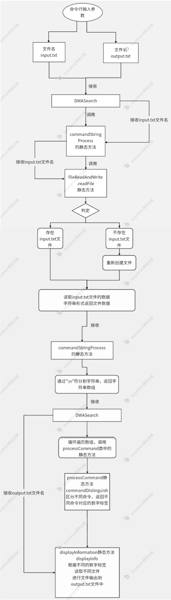
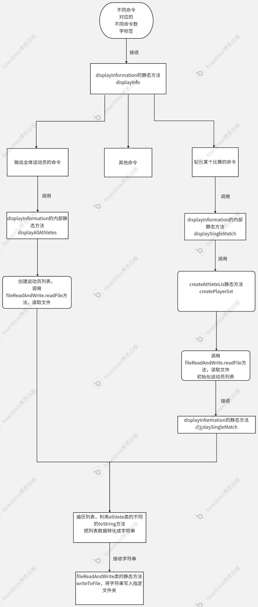

# DWASearch

---

## 项目结构

```
|- src/
   |- DWASearch.java          # 主程序，处理命令行参数，协调各模块
   |- Lib/                    # 包含辅助功能的类
      |- athlete.java             # 表示运动员数据的模型类
      |- commandStringProcess.java # 解析命令输入和识别
      |- createAthleteList.java    # 创建运动员列表并处理赛事数据
      |- displayInformation.java   # 管理数据展示和结果输出
      |- fileReadAndWrite.java     # 文件读取和写入功能
|- data/                     # 输入和输出文件目录
```

---

## 模块设计

### 1. `DWASearch.java`

- **功能**：主程序入口，协调命令处理和结果输出。
- **设计**：
  - 从命令行获取输入/输出文件路径。
  - 使用 `commandStringProcess` 模块解析命令。
  - 根据解析结果调用 `displayInformation` 进行数据展示。

### 2. `athlete.java`

- **功能**：运动员信息的封装类。
- **设计**：
  - 属性：姓名、性别、国家、初赛/半决赛/决赛得分和排名。
  - 方法：
    - 格式化运动员信息。
    - 支持同步项目运动员的姓名排序。

### 3. `commandStringProcess.java`

- **功能**：命令解析模块。
- **设计**：
  - 提供命令映射，支持快速识别命令。
  - 错误处理：针对未识别或格式错误的命令返回相应的错误码。

### 4. `createAthleteList.java`

- **功能**：从输入文件中解析运动员和比赛数据。
- **设计**：
  - 使用正则表达式提取得分并计算累加总分。
  - 处理运动员数据，支持更新已有记录。

### 5. `displayInformation.java`

- **功能**：根据命令展示运动员或比赛信息。
- **设计**：
  - 支持按国家和姓名排序运动员列表。
  - 针对详细展示模式，输出包括初赛、半决赛和决赛的分数和排名。

### 6. `fileReadAndWrite.java`

- **功能**：文件操作模块。
- **设计**：
  - 提供安全的文件读取和写入方法。
  - 自动创建缺失文件。

---

## 流程图如下：

**1.首先是DWASearch主方法内的流程图:**



## 2.然后是displayInformation类内的静态方法displayInfo流程图:



## 算法关键点

1. **正则表达式解析**
   
   - 使用 `Pattern` 和 `Matcher` 提取数字。

2. **自定义排序**
   
   - 通过 `Comparator` 实现按国家和姓氏排序。

3. **命令映射**
   
   - 使用 `HashMap` 快速匹配命令字符串，减少复杂判断逻辑。

---

## 性能优化

1. **文件读取**
   
   - 使用 `BufferedReader` 批量读取文件内容，减少磁盘IO操作。

2. **数据存储**
   
   - 使用 `HashMap` 判断某个运动员信息是否已经存储到List列表中，若列表中已经有改运动员，则在原来的基础上添加信息，若没有则新建应该运动员对象存储到列表。

3. **排序优化**
   
   - 使用 `Arrays.sort` 和`List.sort`结合自定义比较器，优化排序性能。

4. **运动员分数处理**
   
   - 使用`stream()` 方法返回一个顺序流,对集合中的元素进行一系列操作。

---

## 错误处理

1. **文件缺失**
   
   - 自动创建输入/输出文件，避免程序中断和读取写入文件错误的异常处理。
     
     读取的文件创建
     
     ```java
     public static String readFile(String directory) throws IOException{
             File file = new File(directory);
             StringBuilder sb = new StringBuilder();
             sb.setLength(0);
             if (!file.exists()) {//文件不存在，自动创建
                 System.out.println("Input file does not exist, creating new file");
                 file.createNewFile();
                 return "";
             }
             try {
                 BufferedReader br = new BufferedReader(new FileReader(file));
                 String line;
                 while ((line = br.readLine())!= null) {
                     sb.append(line).append("\n");
                 }
                 br.close();
             } catch (IOException e) {
                 System.out.println("Error reading file");
             }
             return sb.toString();
         }
     ```
     
     输出的文件创建
     
     ```java
     public static void writeToFile(String data) throws IOException{
             if (data == null)
                 return;
             String directory =DWASearch.outputFile;
             File file = new File(directory);
             try {
                 if (!file.exists()) {//文件不存在，自动创建
                     System.out.println("Output file does not exist, creating new file");
                     file.createNewFile();
                 }
                 FileWriter fw = new FileWriter(file.getAbsolutePath(),true);
                 BufferedWriter bw = new BufferedWriter(fw);
                 bw.append(data);
                 bw.close();
             } catch (IOException e) {
                 System.out.println("Error writing to file");
             }
         }
     ```

2. **空文件处理**
   
   - 检测到空输入则跳过，不做任何输出。
     
     ```java
     public static String[] commandInput() {
             String fileCommand = "";
             try {
                fileCommand= fileReadAndWrite.readFile("com/src/Data/"+DWASearch.inputFile);
             }catch (IOException e) {
                 e.printStackTrace();
             }
             if(fileCommand.isEmpty())
                 return new String[0];//空输入返回长度为0的String数组
             return fileCommand.split("\n");
         };
     ```
     
     ```java
     public int commandDistinguish(String command) { 
         if(command.isEmpty()) 
             return 0;//检测到数组长度为0，则返回命令标签0，代表不做任何操作
              //其他代码 省略
     };
     ```

------

## 单元测试

### 单元测试计划模板

| 测试用例                           | 测试目标                           | 结果  |
|:------------------------------:| ------------------------------ | --- |
| “”                             | 验证是否不做输出                       | 通过  |
| "result"                       | 验证输出是否为"N/A"+"\n"              | 通过  |
| "player"                       | 验证对应非法命令是否输出"Error"+"\n"       | 通过  |
| "result"+比赛名称                  | 验证是否正确输出比赛结果                   | 通过  |
| "players"                      | 验证是否正确输出所有运动员                  | 通过  |
| "result "+比赛名称+"detail"        | 验证是否正确以详细格式输出运动员信息             | 通过  |
| 连续多行命令"result"+比赛名称+"detail"   | 验证是否正确接收连续的命令并逐一输出             | 通过  |
| "result player"                | 验证是否正确处理非法比赛名称的命令              | 通过  |
| “result ”+比赛名称+"多个空格"+"detail" | 验证是否正确处理包含多个空格的命令，输出"N/A"+"\n" | 通过  |

### 

### 测试代码

1.

```java
package com.src.Lib;

import org.junit.jupiter.api.Test;
import static org.junit.jupiter.api.Assertions.*;

public class CommandStringProcessTest {

    // 测试正常路径（happy path）
    @Test
    public void testCommandDistinguish() {
        CommandStringProcess processor = new CommandStringProcess();

        // 测试有效的命令
        assertEquals(10, processor.commandDistinguish("players"));
        assertEquals(21, processor.commandDistinguish("result women 1m springboard"));
        assertEquals(121, processor.commandDistinguish("result women 1m springboard detail"));
        assertEquals(31, processor.commandDistinguish("result men 1m springboard"));
        assertEquals(134, processor.commandDistinguish("result men 3m synchronised detail"));
    }

    // 不合理命令
    @Test
    public void testCommandDistinguishInvalidCommand() {
        CommandStringProcess processor = new CommandStringProcess();

        // 测试空命令
        assertEquals(0, processor.commandDistinguish(""));

        // 测试未识别的命令
        assertEquals(-1, processor.commandDistinguish("unknown command"));

        // 测试只包含"result"的命令
        assertEquals(1, processor.commandDistinguish("result"));

        // 测试不完整的命令
        assertEquals(1, processor.commandDistinguish("result women"));

        assertEquals(1, processor.commandDistinguish("result men invalid"));
    }
}
```

---

2.

```java
package com.src.Lib;

import org.junit.jupiter.api.Test;
import static org.junit.jupiter.api.Assertions.*;
import java.io.IOException;
import java.util.List;

public class CreateAthleteListTest {

    // 测试正常路径
    @Test
    public void testCreatePlayerList_HappyPath() throws IOException {
        //"men 10m synchronised.txt"文件里面只有7组运动员的数据，所以列表长度应该为7
        String fileName = "men 10m synchronised.txt";

        // 调用方法
        List<Athlete> athleteList = CreateAthleteList.createPlayerlist(fileName);


        assertNotNull(athleteList);
        assertEquals(7, athleteList.size());
        //列表中第一组运动员的数据就是我的Data文件中男子10m同步赛文件的最开头的的运动员数据
        assertEquals("Full Name:EIKERMANN GREGORCHUK Jaden Shiloh & BARTHEL Timo", athleteList.get(0).getFullName());
        assertEquals("Final Score:50.40 + 50.40 + 72.96 + 74.25 + 71.40 + 72.96 = 392.37", athleteList.get(0).getFinalScore());
    }

    // 测试空文件情况
    @Test
    public void testCreatePlayerList_EmptyFile() throws IOException {
        String fileName = "empty.txt"; // 这是一个不存在的文件

        List<Athlete> athleteList = CreateAthleteList.createPlayerlist(fileName);

        assertNotNull(athleteList);
        assertTrue(athleteList.isEmpty()); // 应该返回空列表
    }
}
```

3.

```java
package com.src.Lib;

import org.junit.jupiter.api.*;

import java.io.*;

import static org.junit.jupiter.api.Assertions.*;

public class FileReadAndWriteTest {

    private static final String outputFile = "outputFile.txt"; // 输出文件路径

    @Test
    public void testWriteFileAndReadFile() throws IOException {
        // 测试正常读取文件的情况
        FileWriter writer = new FileWriter(outputFile);
        writer.write("Hello, World!\n");
        writer.close();

        String content = FileReadAndWrite.readFile(outputFile);
        assertEquals("Hello, World!\n", content); // 验证读取内容是否正确
    }

    @Test
    public void testReadFileButFileNotExist() throws IOException {
        // 测试文件不存在的情况
        String content = FileReadAndWrite.readFile("nonexistent.txt");
        assertEquals("", content); // 验证返回内容为空
    }

    @Test
    public void testWriteToFileNullData() throws IOException {
        // 测试写入的数据为null的情况
        FileReadAndWrite.writeToFile(null, outputFile);

        // 验证文件为空
        assertTrue(new File(outputFile).exists()); // 验证文件已经创建
    }
}
```

4.

```java
package com.src.Lib;

import org.junit.jupiter.api.Test;

import java.io.IOException;

import static org.junit.jupiter.api.Assertions.*;
class DisplayInformationTest {
    //women 10m synchronised.txt 文件内容最短，所以我将他作为测试用例
    @Test
    //这是测试非detail的显示信息
    public void testDisplayInformation() throws IOException {
        try {
            DisplayInformation.displaySingleMatch("women 10m synchronised.txt",25,"output1.txt");
        } catch (IOException e) {
            throw new RuntimeException(e);
        }
        assertEquals("" +
                        "Full Name:WASSEN Christina & WASSEN Elena\n" +
                        "Rank:1\n" +
                        "Score:49.20 + 43.20 + 67.20 + 61.20 + 69.12 = 289.92\n" +
                        "-----\n" +
                        "Full Name:CARVAJAL Ana & ANTOLINO Valeria\n" +
                        "Rank:2\n" +
                        "Score:42.60 + 40.20 + 61.20 + 56.55 + 54.72 = 255.27\n" +
                        "-----\n" +
                        "Full Name:PFEIF Pauline Alexandra & COORDES Carolina\n" +
                        "Rank:99\n" +
                        "Score:46.20 + 46.80 + 55.68 + 66.24 + 57.60 = 272.52\n" +
                        "-----\n",
                FileReadAndWrite.readFile("output1.txt"));
    }
    @Test
    public void testDisplayPartialPlayerInformation() throws IOException {
        try {
            DisplayInformation.displayAllAthletes("output2.txt");
        } catch (IOException e) {
            throw new RuntimeException(e);
        }
        //我把全部运动员的信息都输出到了output2.txt文件中
        String content= FileReadAndWrite.readFile("output2.txt");
        //这里的getStringBeforeNthCharacter方法的作用是找到第8个'\n'字符之前的字符串(包括第8个\n)，并返回
        content= StringProcessor.getStringBeforeNthCharacter(content, '\n',8);
        //根据我自己的allAthlete.txt文档内容，第8个\n前面的字符串应该有2个运动员的信息，所以我只比较前2个运动员信息是否正确输出输出
        assertEquals("" +
                "Full Name:HART Alexander\n" +
                "Gender:Male\n" +
                "Country:Austria\n" +
                "-----\n" +
                "Full Name:LOTFI Dariush\n" +
                "Gender:Male\n" +
                "Country:Austria\n" +
                "-----\n",content);
    }
}
//下面是StringProcessor.java文件的内容，作用是截取字符串的第n个特定字符之前的字符串，包括第n个特定的字符一起作返回
public class StringProcessor {

    public static String getStringBeforeNthCharacter(String input, char targetChar, int n) {
        int count = 0;
        int index = -1;

        for (int i = 0; i < input.length(); i++) {
            if (input.charAt(i) == targetChar) {
                count++;
                if (count == n) {
                    index = i;
                    break;
                }
            }
        }

        if (index == -1) {
            return ""; // 如果没有找到第n个特定字符，返回空字符串
        }

        return input.substring(0, index)+"\n"; // 返回第n个特定字符前的字符串
    }
}
```

------
