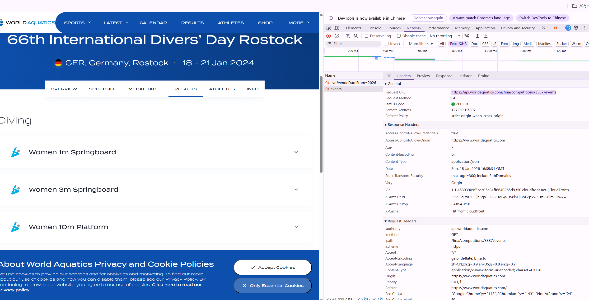
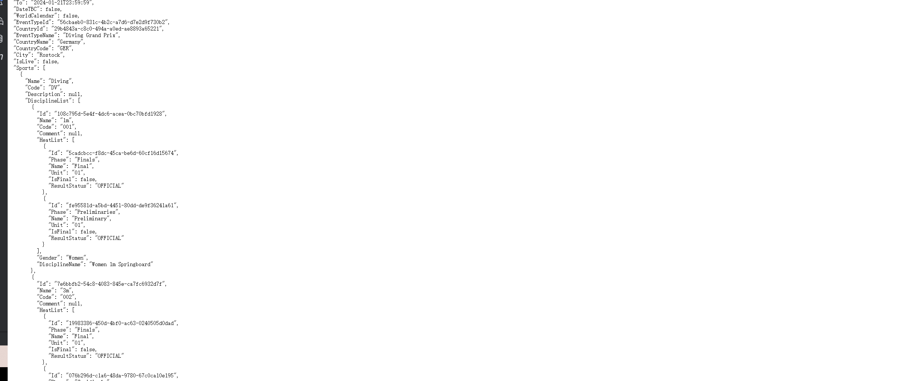
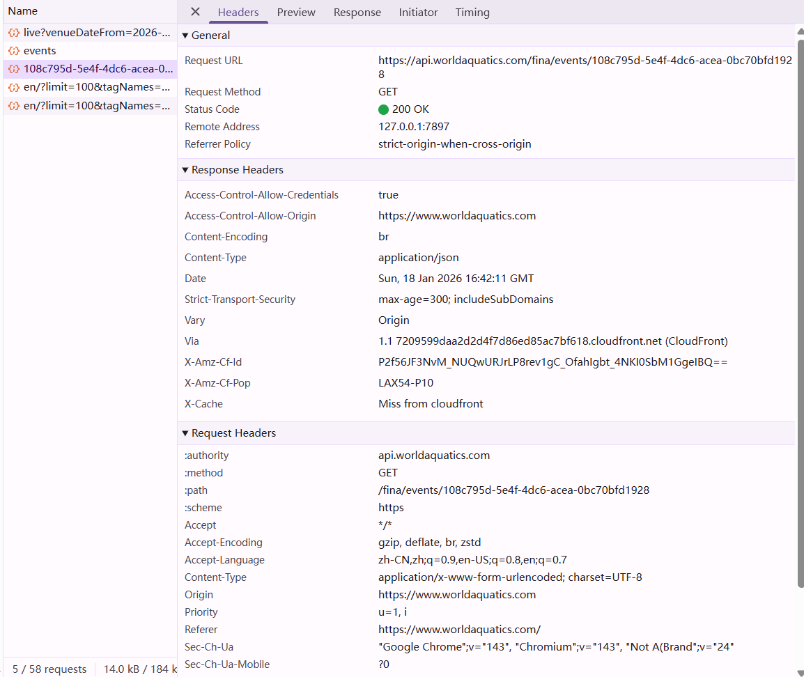
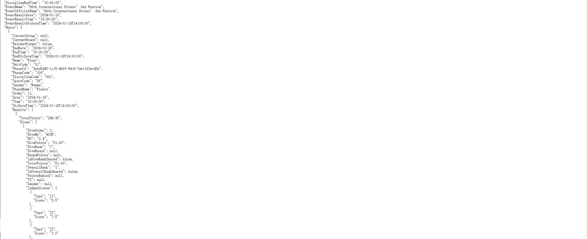
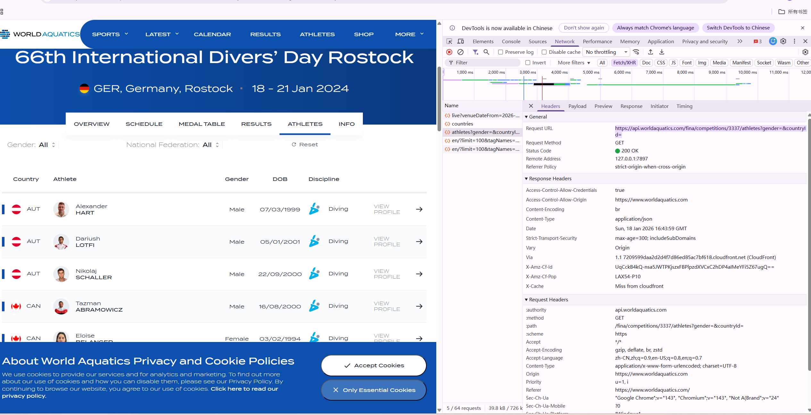
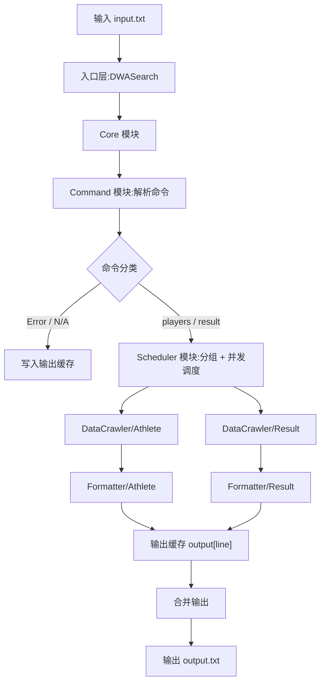

# DWASearch - 爬虫开发进度与数据抓取过程

目前本项目已完成核心数据的分析与爬虫模块的初步实现。以下是关于如何通过分析官网 API 实现自动化数据抓取的详细过程。

## 数据抓取过程分析

### 1. 寻找数据源 (F12 分析)
在开发初期，我们通过访问世界泳联官网的[跳水项目结果页](https://www.worldaquatics.com/competitions/3337/66th-international-divers-day-rostock/results)，使用浏览器开发者工具（F12）的 **Network (网络)** 面板进行抓包分析。

在 **XHR/Fetch** 过滤项中，我们发现了页面加载时调用的核心接口。

### 2. 获取赛事资源清单
通过 F12 面板，我们定位到了获取该次锦标赛所有项目分类及资源 ID 的核心接口。
- **API 地址**: `https://api.worldaquatics.com/fina/competitions/3337/events`
- **过程**: `events_api_discovery.png` 展示了在 Result 首页通过 JS 调用发现该 API 网址的过程。

直接访问该 API 网址，我们可以得到完整的 JSON 信息（如 `events_list_json.png` 所示）。在该数据中，每个项目（如 `Women 1m Springboard`）都对应一个唯一的 `Id`，这是后续抓取详细成绩的关键钥匙。

### 3. 定位具体比赛项目详情
当我们在网页上点击具体的比赛项目时，JS 会携带第一步中获得的资源 ID，发起第二次 API 请求。
- **详情接口**: `https://api.worldaquatics.com/fina/events/{EventId}`
- **过程**: `event_details_api_discovery.png` 记录了点击项目后触发的第二次 JS 调用及其对应的详情 API 地址。

访问该详情 API，即可获得如 `event_details_json.png` 所示的详细比赛数据。该 JSON 结构包含了所有的 `Heats`（初赛、半决赛、决赛）以及选手的每一跳得分、总分和最终排名。

### 4. 获取所有运动员信息
与赛事结果不同，运动员信息的获取更为直接。通过分析运动员列表页的 XHR 请求（如 `athletes_list_xhr.png` 所示），我们发现服务器会一次性返回参与该次锦标赛的所有运动员及其所属国家的结构化 JSON 数据。
- **运动员接口**: `https://api.worldaquatics.com/fina/competitions/3337/athletes?gender=&countryId=`
- **特点**: 无需像赛事结果那样进行二次跳转或动态加载，单次请求即可获取完整名录，这极大地方便了数据的同步与持久化。

### 5. 爬虫代码实现逻辑
基于上述逆向分析出的请求逻辑，我在 `DataCrawler` 模块中实现了对应的自动化抓取流程：
1. **赛事数据抓取**: `ResultCrawler` 采用“先匹配 ID，再获取详情”的策略。
2. **运动员数据抓取**: `AthleteCrawler` 采用“单次全量抓取”策略。
3. **本地化存储**: 所有抓取到的原始数据都会被持久化存储在本地 `data/` 目录中。

---

## 代码总体流程（框架图）

> 下面使用 Mermaid 绘制整体流程，展示从 **输入命令** 到 **执行计算** 再到 **输出 output.txt** 的整体大致过程。

## 模块分解与关系

本项目按模块拆分，确保职责单一、边界清晰。下面按模块逐一说明，并给出对应的关系图。

### 入口层：DWASearch

**主要职责**：读取命令行参数与文件路径，作为程序入口启动整个流程，并将最终结果写入输出文件。  
**协作关系**：仅与 Core 模块交互，不直接参与业务逻辑。  
**工作方式**：读取 input → 调用 Core → 将 Core 返回的字符串写入 output。

### Core 模块

**主要职责**：流程总控，负责串联命令解析、任务分组调度与输出合并，是系统的“中枢”。  
**协作关系**：调用 Command 模块完成解析；调用 Scheduler 执行任务；最终输出交还给入口层。  
**工作方式**：解析命令 → 处理 Error/N/A 立即输出 → 构建 Task 列表 → 调度并发执行 → 合并输出。

### Command 模块

**主要职责**：逐行解析输入指令，输出结构化命令对象，并对非法指令直接生成 Error/N/A。  
**协作关系**：为 Core 模块提供可执行的命令列表；错误输出也由该模块判断。  
**工作方式**：读取单行 → 识别命令类型 → 校验参数（项目名/detail）→ 生成 Command 对象或错误输出。

### Scheduler 模块

**主要职责**：按数据来源分组任务并并发执行，避免重复抓取，同时保持输出顺序。  
**协作关系**：接收 Core 的 Task 列表；调用 QueryService（Athlete/Result）完成查询；写回输出缓存。  
**工作方式**：分组 → 并发执行 → 共享结果 → 写回 `output[line]` → 等待全部完成。

### Common 模块（公共接口）

**主要职责**：提供跨模块统一接口，抽象“抓取数据 / 格式化输出 / 查询入口”的能力。  
**协作关系**：DataCrawler 实现这些接口；Scheduler 通过 QueryService 统一调用业务逻辑。  
**工作方式**：接口定义在 Common 层，业务实现下沉到 DataCrawler，调度层仅依赖接口。

### DataCrawler/Athlete 模块

**主要职责**：抓取运动员列表数据并输出规范化格式。  
**协作关系**：AthleteQueryService 组合 AthleteCrawler + AthleteFormatter，被 Scheduler 调用。  
**工作方式**：Crawler 拉取 JSON → Formatter 输出 Full Name / Gender / Country → 返回给调度层。

### DataCrawler/Result 模块

**主要职责**：抓取赛事摘要与项目详情，完成决赛输出与 detail 全阶段输出。  
**协作关系**：ResultQueryService 组合 ResultCrawler + ResultFormatter，被 Scheduler 调用。  
**工作方式**：先拉取 summary 构建项目映射 → 按 eventId 抓取详情 → Formatter 生成结果输出。

## 单元测试说明

本项目使用 JUnit5 编写测试用例，集中在 `stage_2/test/` 目录，用于验证**命令解析、核心流程与格式化输出**的正确性。主要覆盖点如下：

- **CommandParserTest**：验证合法/非法指令解析、大小写敏感、detail 后缀规则、空行处理等。  
- **CoreModuleTest**：验证 Error/N/A 直接输出、任务分组调度与输出合并、IO 异常处理。  
- **TaskSchedulerTest**：验证分组执行、并发写回、异常处理与多组任务执行顺序。  
- **AthleteFormatterTest**：验证运动员输出格式、性别映射、空输入处理。  
- **ResultFormatterTest**：验证决赛/详情输出、双人项目姓名排序、缺失分数容错等。

## 异常处理说明

本项目没有独立的“异常处理模块”，而是将异常处理分散到各个关键环节，保证流程稳定、输出可控。

- **解析阶段（Command 模块）**  
  无法识别的指令输出 `Error`；项目名或 detail 规则不合法输出 `N/A`，并直接写入输出缓存。

- **IO 阶段（Core 模块）**  
  读取输入文件失败时返回明确错误信息，避免继续进入调度流程。

- **运行阶段（Scheduler 模块）**  
  抓取或格式化时发生异常，统一返回“网络不好 请求失败”，并写回对应的 `output[line]`，不影响其他指令执行。

- **线程阶段（Scheduler 模块）**  
  join 等待过程中如被中断，会设置中断标记，保证主流程可收敛结束。

