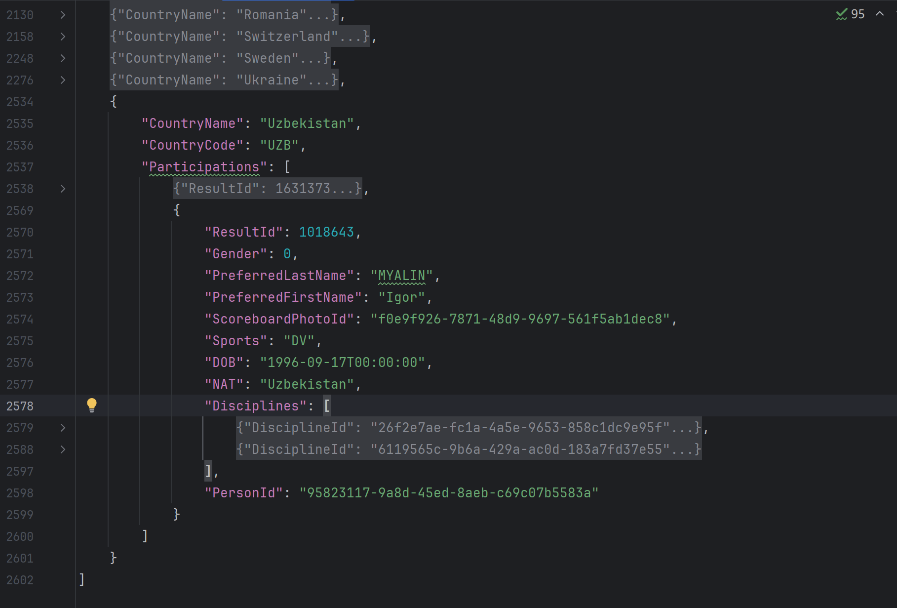
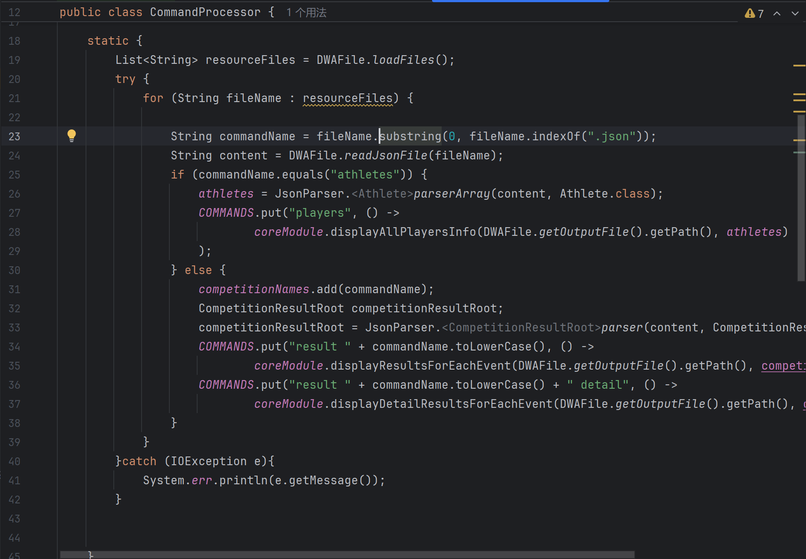
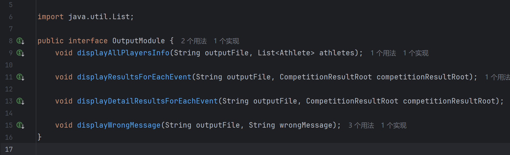
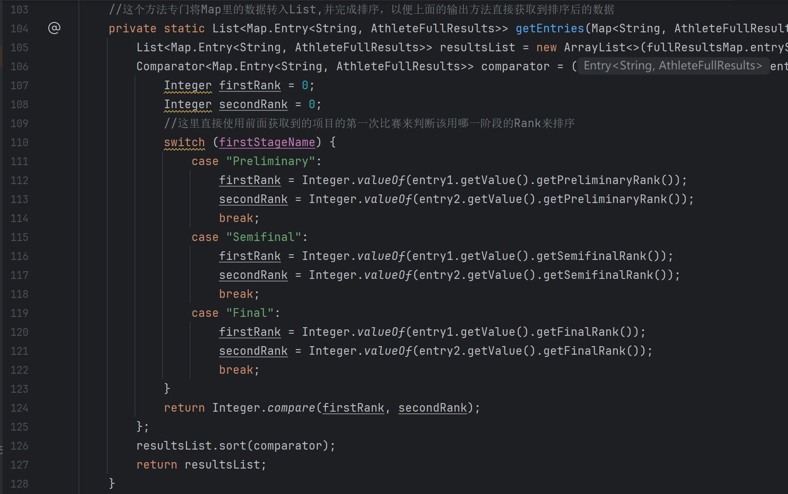
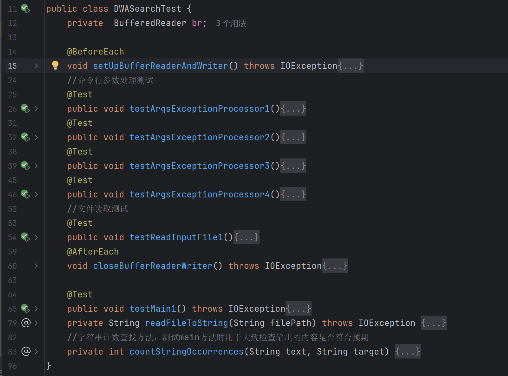
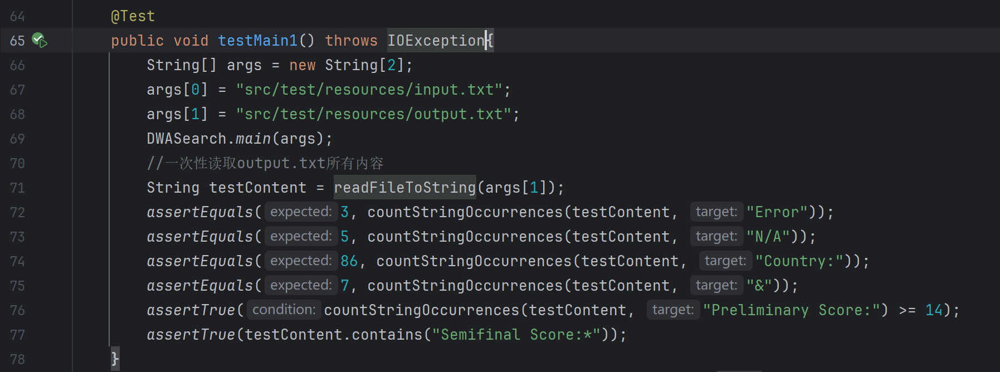
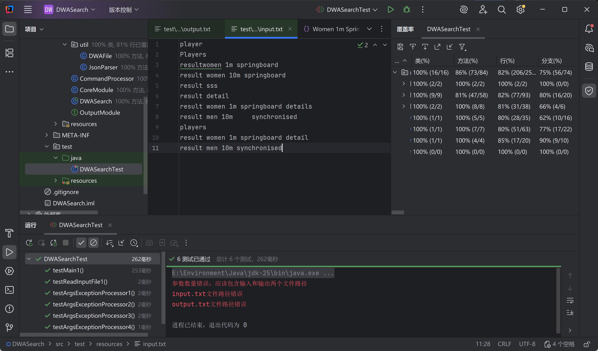

# 1. 接口模块的设计与实现过程
## 1.1 数据爬取与解析封装
根据学长的引导手动获取json文件：https://github.com/LunaY77/DWASearch/tree/main?tab=readme-ov-file

获取所有json内容后，先明确我们要获取的数据有哪些，然后再观察对应的json数据，看一看这些数据的位置在哪里，并设计出相应的JavaBean来装载这些数据类型。

这里我使用的是**Jackson**来解析数据，想要获取到一些深藏在嵌套结构深处的数据，必须为每一层都写一个JavaBean，设计字段来持有其内部的数据。**JavaBean的类的嵌套结构与原json数据结构要完全对应。**

要解析的数据可以分为全体运动员数据和比赛项目数据两种类型。

### 1.1.1 运动员数据解析
首先明确要输出的数据：Full Name, Gender, Country 


观察athletes.json数据可以发现，最外层是一个数组，我们需要的"Country"就在这个数组的元素里面。最外层数组可以直接被解析为List，那就从它的元素开始写JavaBean类。

继续观察，发现数组元素的Participations数组里面有我们要的Gender，虽然是以数字来表示，但是输出结果时调整一下就好了。还有Full Name，在这里以Last和First分开的方式记录，要为他们分别创建一个字段。

**设计运动员数据的JavaBean**

```markdown
Athletes类
└── 字段：
    ├── String Country
    └── List<Participations> participations
        Participations类
            ├── String lastName
            ├── String firstName
            └── Integer Gender
```
### 1.1.2 比赛项目数据解析
再以同样的思路观察其他比赛项目结果的json文件，比赛项目的输出有两种模式，**detail**和**非detail**。

**比赛项目的嵌套结构**
```markdown
CompetitionResultRoot类
└──List<Heats> heats
    Heats类
    ├── *String stageName
    └── List<Results> results
        Results类(toString)
        ├── Double totalPoints
        ├── Integer rank
        ├── String fullName
        ├── List<Dives> dives
        |   Dives类
        |   └── String divePoints
        └── *List<Competitors> competitors
            Competitors类
             └── String fullName

AthleteFullResults辅助类
├── String preliminaryRank 
├── String semifinalRank
├── String finalRank
├── StageScore preliminaryScore;
├── StageScore semifinalScore;
└── StageScore finalScore
    StageScore内部类(toString)
    ├── List<Dives> dives
    └── Double totalPoints

```
在上面的结构中，简略输出时只使用CompetitionRoot下的结构。Results类包含了大部分需要输出的信息，因此覆写toString方法整理输出。

Heats数组下就是装有比赛项目每个阶段的结果的元素。

stageName的设置是为了获取阶段名称，为后面的按阶段初始化数据和按第一次比赛结果来排序做准备。

这里边还有一个辅助类，用于存放详细的比赛数据，后面用hashMap与运动员名字对应，确保不会重复运动员信息。构建一个内部类，因为后面输出时要求各阶段都输出小分相加还有总分，把这部分先封装起来方便管理，顺便也覆写了toString整理一下格式。

除了个别类覆写了toString，所有类都写了getter和setter，这是数据解析的需要，也方便后面核心类方法获取相应字段的内容。

## 1.2 核心类实现
### 1.2.1 工具类
编写了两个工具类，**DWAFile**和**JsonParser**

**DWAFile** 用于初始化所有资源文件，即所有json文件，同时接收传入的文件路径并初始化input.txt和output.txt的文件对象。

两大方法：
1. 初始化所有资源文件名
2. 用InputStream读取资源文件内容，最终转换为字符串

(一开始这个类把所有资源文件都初始化为File对象，但是后来才知道一旦项目打包成jar就不能依靠FileReader来读取资源文件了，只好手动添加文件名来初始化)

**JsonParser** 用于解析json文件，提供两种方法
解析为类和解析为List

---
### 1.2.2 接口与核心类
核心类包括**CoreModule**和**CommandProcesser**

CoreModule实现了自定义的OutputModule接口，并实现了里面的全部方法。

#### CommandProcessor

该类专门用于命令的初始化和启动执行，主要有static代码块和一个runCommand方法

**static初始化命令**：

一个static代码块在类加载时执行，根据DWAFile提供的文件名字初始化命令，用Map<String, Runnable>储存。**所有数据仅解析一次，直接封装入设计好的类中**。命令名直接与需要执行的对应方法绑定好。

**检查或执行命令(runCommand())**：

该方法直接由DWASearch主类的main方法调用，根据output.txt的命令做出响应。

具体逻辑:

首先，检查命令是否在初始化过的命令Map中，如在，则直接执行，无需检查。

不能执行的，检查前缀是否为"players"或者"result "(后带空格)，如否，则直接输出"Error"。

如果前缀是"result "，那么命令只能是后面出问题了，统一输出"N/A"(包括比赛名不存在、detail拼写错误等情况)。

---
#### OutputModule / CoreModule

OutputModule接口包含四个方法

                                
分别用于：

    输出运动员信息

    输出比赛项目决赛结果

    输出比赛项目详细结果

    输出命令错误信息

除了输出详细结果外，其他三个方法的实现都比较简单，顶多用toString规定好输出格式，提取相应数据，简单调整就可以输出。

输出详细结果的方法由于使用了Map<String, AthleteFullResults>来实现运动员名字与详细结果的对应关系，还要兼顾阶段比赛结果的逐步初始化，双人运动项目运动员名字要用"&"来连接(原文件用"/")，最后还要实现按照第一次比赛的Rank来输出结果，这就不得不再写一个方法来负责把Map的key和value都装进一个新的List然后写一个排序逻辑再返回排序好的List以供输出。

排序方法：



# 2. 性能改进
这个项目主要会出现重复操作的地方大概就是解析数据和读写文件。

对于数据解析，我已经在DWAFile类使用了static代码块来初始化一遍所有数据并把他们封装进类。

对于读写文件，我能想到的方案就是要写入文件的内容先整合到一起，再统一写入文件(单次write)。不过时间有点紧，我还没有实现。BufferedWriter能提高写入效率，我也都在使用。

# 3. 单元测试

写了一个测试类用于测试主类中的所有方法，包括但不限于main方法。对于main方法，提供了11个用例用于测试，基本上是要求示例里的，再加上几个正常输出的例子。没有写更多用例是因为断言写不过来。其他的情况自己也有输出检查过，没有发现问题，只是单元测试不好写。

测试方法：

其中main方法的测试方法：


测试结果：


# 4. 异常处理
写了两个异常类，命令行参数异常类和文件路径异常类。

在主类中编写了专门处理命令行参数有关问题的方法，负责对应异常时抛出这两个异常，并打印错误信息。

其他的读写异常都正常用try-catch来捕获并打印错误信息。
