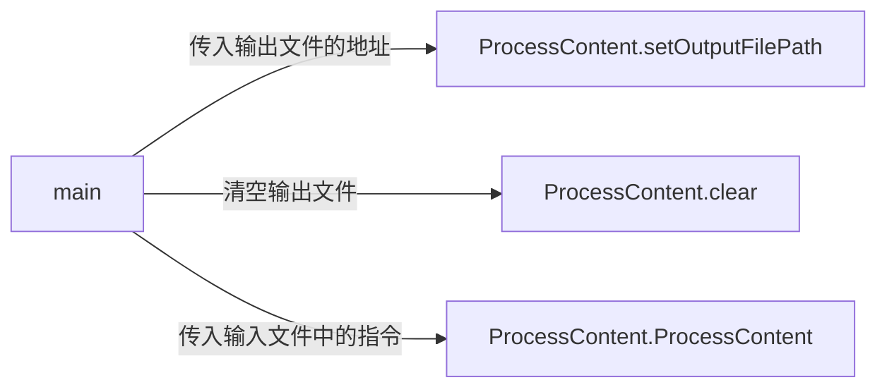
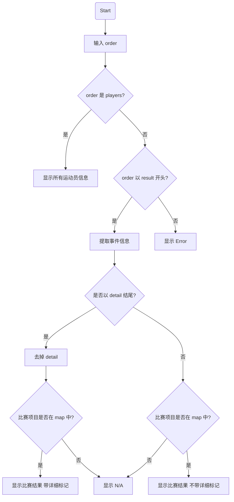
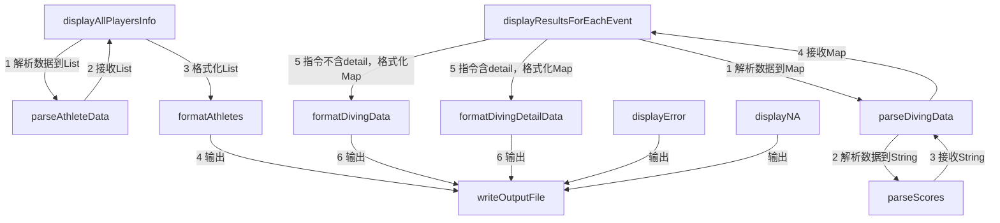

## 1. 模块接口的设计与实现过程
### 1.1 本项目共有四个模块：</br>
> *存放数据的data*</br>*负责接收命令行参数的DWASearch*</br>*沟通命令行参数与输出模块的ProcessContent*</br>*负责格式化输出的CoreModule*</br>

### 1.2 模块接口的设计


| **模块**           | **接口名称**                           | **功能说明**                                                                 |
|--------------------|---------------------------------------|-----------------------------------------------------------------------------|
| **DWASearch**      | `main(String[] args)`                | 主程序入口，解析命令行参数，调用 `ProcessContent` 模块处理输入指令。            |
| **ProcessContent** | `processContent(String input)`  |根据输入指令，调用对应的核心逻辑模块接口。                                    |
|                    | `clear()`                            | 清空输出文件，确保每次运行程序不会叠加之前的结果。                           |
| **CoreModule**     | `displayAllPlayersInfo(String path)` | 输出所有选手信息，读取并解析文件内容，格式化后写入输出文件。                  |
|                    | `displayResultsForEachEvent(String path, boolean detailed)` | 输出指定比赛的结果，支持简略或详细模式的切换。 |


### 1.3 各模块结构：</br>
*1.* data包含**info文件夹**，**input.txt**和**output.txt**，info文件夹包含**运动员信息**和**比赛结果**。
*2.* DWASearch包含主函数**main()**。

> 方形代表函数，圆形代表变量

*3.* ProcessContent包含**clear()**，**processContent()**，**outputFilePath**，**setOutputFilePath()**和**map**

> map存储着指令与data中数据的相对路径的映射关系，outputFilePath存储输出路径，setOutputFilePath()负责设置outputFilePath。

*4.* CoreModule中有四个display主要接口，供ProcessContent.processContent()调用

将过程细分为解析，格式化，输出三步，便于纠错
## 性能改进

### 优化点
1. **文件读取与写入**：
    - 使用缓冲流（`BufferedReader` 和 `BufferedWriter`）减少磁盘 I/O 操作，提高效率。

2. **排序效率**：
    - 使用 Java 的 `sort` 方法，时间复杂度为 \(O(n \log n)\)，适用于大规模数据的排序。
    - 利用 `Comparator` 和 Java Streams 简化多关键字排序逻辑。

3. **模块化调用**：
    - 避免重复解析文件，模块之间合理划分职责，减少不必要的重复计算。

---
### 性能优化示例代码

### 文件读取优化
使用缓冲流读取文件，降低频繁 I/O 开销：
```code
try (BufferedReader reader = new BufferedReader(new FileReader(inputFilePath))) {
    String line;
    while ((line = reader.readLine()) != null) {
        process(line); // 按行处理数据
    }
}
```
## 3. 单元测试展示
### DWASreach的测试
测试模板
```code
    @Test
    public void testMain() {
        try{
            String[] args = {"input.txt", "output.txt"};
            createTestInputFile("src/data/input.txt", "测试用例");

            DWASearch.main(args);

            String output = Files.readString(Paths.get("src/data/output.txt"));
            assertEquals("答案",output);
        }catch (IOException e){
            System.out.println(e.getMessage());
        }
    }

```
| **"测试用例"**                                                                   | **测试结果** | **测试目的**              |
|------------------------------------------------------------------------------|----------|-----------------------|
| ""                                                                           | 通过       | 检测空输入                 |
| "Result women 1m springBoard detail"                                         | 通过       | 检测大小写输入               |
| "result women 1m springboarddetail"                                          | 通过       | 检测指令格式                |
| "result women 10m synchronised.txt detail"                                   | 通过       | 检测项目识别                |
| "result women 10m synchronised detail"                                       | 通过       | 检测女子result-detail正常输出 |
| "result women 10m synchronised detail\nresult women 10m synchronised detail" | 通过       | 检测多个指令的叠加             |
| "players"                                                                    | 通过       | 将测players的正常输出        |
| "result men 10m synchronised detail"                                         | 通过       | 检测男子result-detail正常输出 |
| "result women 10m synchronised"                                              | 通过       | 检测result正常输出          |
| "result %&"                                                                  | 通过       | &#……                  |

###4. 异常处理说明
1.命令行参数不正确
解决代码：
```code
if (args.length != 2) {
    System.out.println("Usage: java -jar DWASearch.jar <inputFilePath> <outputFilePath>");
    return;
    }
```
2.找不到输出路径
解决代码：
```code
try {
     ProcessContent.clear();
    } catch (IOException e) {
        System.out.println("Failed to clear: " + e.getMessage());
    }
```
3.输入文件过大
解决代码：
```code
File inputFile = new File(inputFilePath);
final long MAX_FILE_SIZE = 10 * 1024 * 1024;
if (inputFile.length() > MAX_FILE_SIZE) {
    throw new IOException("File too large to process: " + inputFile.getPath());
    }
```
4.解析数据时读取到了错误的行：
解决代码：
```code
if (!rankLine.startsWith("Rank:")) {
    throw new IOException("Invalid format: Expected Rank line but got: " + rankLine);
    }
if (!nameLine.startsWith("FullName:")) {
    throw new IOException("Invalid format: Expected FullName line but got: " + nameLine);
    }
```
> 其余异常由主程序中的try-catch捕获，e.getmessage()显示