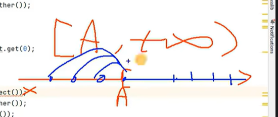

#通配符的使用
##1.通配符：？
##2.使用说明
>举例：ArrayList< ? >
G< ? >可以看作G< A >类型的父类，即可以将G< A >的对象赋值给G< ? >类型的引用（或变量）
##3.读取数据的特点(以集合ArrayList< ? >为例说明)
> 读取数据允许的，读取的值的类型是Object类型
> 写入数据：不允许的。特例：写入null值。

##4.有限制条件的通配符

**List< ? extends A >** : 可以将List< A >或List< B >赋值给List< ?extends A >。其中B类是A类的子类
**List< ? super A>** : 可以将List< A >或List< B >赋值给List< ?extends A >。其中B类是A类的父类
###注：
在extends中可以将？看作是小于等于
在super中可以将？看作是大于等于

##5.有限制通配符的读写操作
技巧：开发中遇到了带限制条件的通配符，在赋值时，如果没报错，那就正常使用，如果报错了，知道不能这样写，改改。

>super可看成该图
注：再看看尚硅谷的视频
