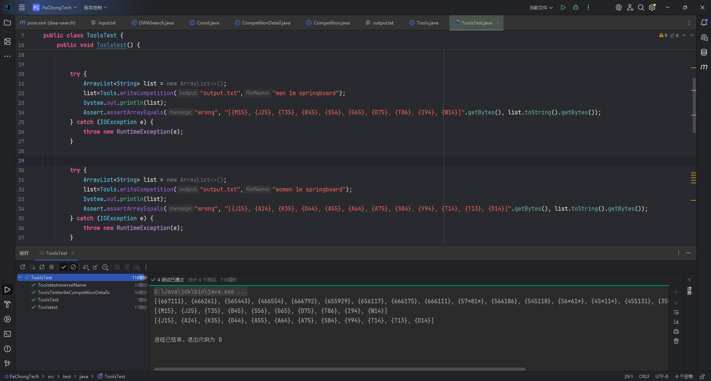

# DWASearch 项目文档

## 项目概述

这是一个命令行程序，主要功能是将网站上的数据爬取下来，并根据 `input.txt` 中的内容进行数据的处理和输出。

## 主要类

### DWASearch
程序的主入口，主要作用是：
- 接受参数
- 逐行读取 `input.txt` 内容
- 调用判断方法

### Athlete
当输入为 `players` 时，充当数据的中转站，方便从 JSON 数据转到可用的 `String`，同时重写了 `toString` 方法，为后面进行单元测试提供方便。

### Competition
与 `Athlete` 类类似，充当数据的中转站，方便从 JSON 数据转到可用的 `String`，并重写了 `toString` 方法。

### CompetitionDetails
与 `Athlete` 类类似，充当数据的中转站，方便从 JSON 数据转到可用的 `String`，并重写了 `toString` 方法。

### Constns
提供常量，方便 `choose` 方法判断输入（命令）是否合法。

### Tools
整个程序中最为关键的工具类，提供了数种方法，其中：

#### 6.1 fetchAndWriteAthletes
这个方法实现了：
- 实时从官网上爬取数据
- 暂存在 `Athlete` 对象中
- 由一个 `ArrayList` 存放并排序这些对象
- 最后将它们输出到 `output.txt` 中

#### 6.2 writeCompetition
这个方法从本地获取 JSON 文件，通过类似于 `fetchAndWriteAthletes` 的方式将信息存放到 `output.txt` 中。

#### 6.3 writeCompetitionDetails
与 `writeCompetition` 相似，不过更加复杂：
- 使用 `HashMap` 存放对应的比赛详细信息对象，更加高效可靠
- 同时包含了许多对字符串的处理

#### 6.4 choose
通过分析 `input.txt` 的命令确认应该调用什么方法，同时保证了需求文档中的错误命令处理。

#### 6.5、6.6、6.7
为了节省空间创建的工具方法，很实用。

## 测试

测试类在文件中，针对 4 个方法进行了十余种测试样例的测试。
 