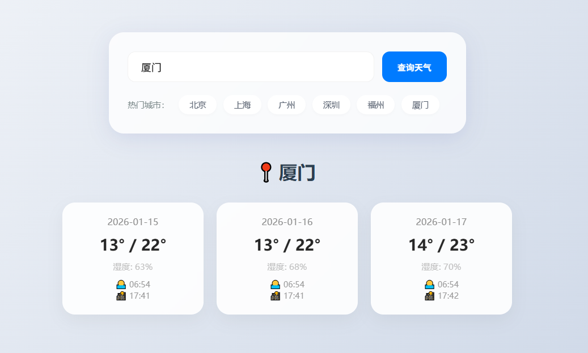

# work3基本任务

项目采用MAVEN和Mybatis，完成基本的增上改查功能并添加至数据库中。

要求保存商品信息，订单信息，由于一个订单不单单只有一个商品，因此需要再建立一个表用于存放某个订单买了什么商品，再从商品表中取得对应商品信息。
关联表将商品ID和订单ID设为联合主键

数据库表设计：

| 表名          | 字段                                       |
|-------------|------------------------------------------|
| commodity   | id(key),name,price,status                |
| my_order    | id,order_time,price                      |
| order_items | my_order_id,commodity_id,commodity_count |

由于之前是在Springboot的基础上使用MAVEN和MyBatis的，现在纯MAVEN环境下有些不同

## 增删改查：

### 增：
商品表先建立起来，在商品表的基础上去创建订单并保存到数据库中，通过主键回填获得改订单的主键id，现在我们有了订单id和商品们的id后就可以建立关联表

两个参数以上或用到foreach时得加@Param(),不然后续MyBatis在解析XML时会报参数错误

考虑到订单中应该存在复数商品，因此关联表中增加commodity_count字段保存商品数量。采用的方案为，先判断关联表中有没有相同order_id和commodity_id相同的数据，有的话则判断商品存在，只需让商品数量+1.

商品表的设计中添加了（status）字段用于判断商品处于上架/售罄状态。后续有考虑到可以加上库存但是由于要改太多东西了，下次一定。

### 删：
1.商品必须保证没有对应订单使用到时才能进行删除

2.订单的删除必须要删除对应关联表

### 改：

1.好像没有需要注意的地方===

### 查：

三表联表查询，获取订单信息。

用订单id左连接关联表，再用关联表中的商品id去左连接商品表获取订单对应的商品信息。

# Bonus:

实现分页查询，在控制台能看到对应页码输出和翻页操作，不过相对简陋和不方便。后续在Springboot项目中有前端会方便很多

使用了Mybatis进行SQL连接，同时在控制台能够看到对应SQL语句输出

## 第三方Api调用:天气预报

该项目用到了Springboot，mybatis。由于不会前端，整个前端的实现由gemini完成。输入城市姓名即可查询到对应天气。
该项目的运行方式为运行WeatherForecastApplication后登录网址（[极简天气预报](http://localhost:8080/index.html)）

实现效果如下图所示

### 基本实现过程
基本流程：前端按钮点击查询->服务器向和平开发者请求数据->将数据保存到服务器中->从服务器中读取数据传给前端

1. 在和风开发者平台官网注册，并得到账号的Host和ApiKey。
2. 在网页点击查询天气时，搜索框中的信息作为城市姓名（cityName）对(https://这里填填写你的Host/v2/city/lookup?key=这里填你的key&location=cityName)发送GET请求得到城市id。
3. 再对（https://你的Host/v7/weather/3d?key=这里填你的key&location=城市id）发送GET请求来获得该市的3日天气json格式信息
4. json的解析采用了restTemplate，使用 Apache HttpClient 5 构造请求工厂，它能自动处理 GZIP。（之前没用过这个，不太熟悉）
5. 数据库的建立： 
6. 
   | 表名            | 字段                                                                         |
   |---------------|----------------------------------------------------------------------------|
   | citys         | id(key),name,lat,lon,update_time                                           |
   | weather_table | id,(fx_date,city_id)(unique key),sunrise,sunset,temp_max,temp_min,humidity |

   同时后端页建立了对应的对象City,Weather用来保存和读取数据库中的数据。对于对象中的List成员，则采用Mybatis的foreach来进行存储，读取则采用ResultMap。
对于发生主键冲突的情况则采用ON DUPLICATE KEY UPDATE 来进行更新操作
7. 保存数据的过程为先删处旧数据，再保存新数据。同时开启了事务处理@Transactional，保证数据一致性。

