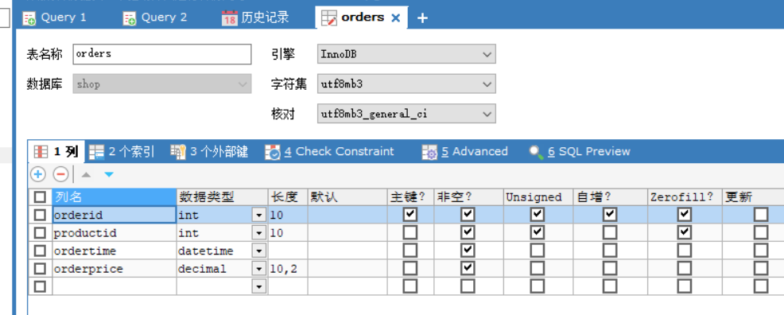
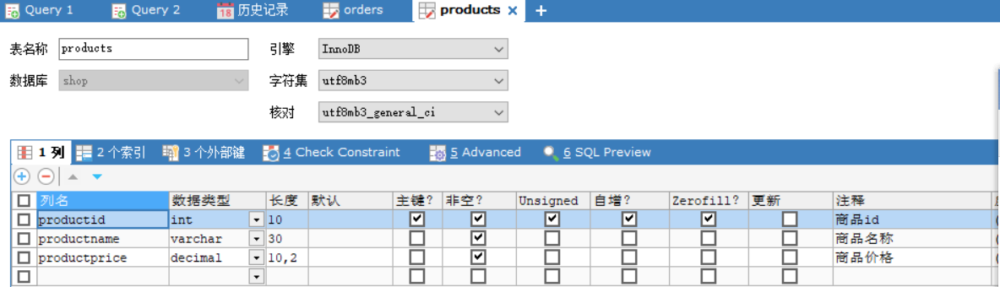

# 项目的介绍以及遇到的一些问题

## 简单介绍

* 该项目的数据库是采用MySQL，通过jdbc连接
* 其中创建的表是通过sqlyog可视化创建的

​	 以下是该shop数据库的表的一些设置





然后是jdbc的代码，我已经放在我的utils文件夹中了，以为当初一开始创建时我想用utils写一堆类的方法，后面给忘了，就全写一起了，所以里面tools的代码有点繁琐。

然后是里面的配置文件，以为那个配置文件是在src目录下的，我不知道直接复制过来能不能用

```properties
driver=com.mysql.cj.jdbc.Driver
url=jdbc:mysql://localhost:3306/shop?useUnicode=true&characterEncoding=utf8&useSSL=true
username=root
password=1234567
```

代码的tools类主要是提供有关orders表的增删改查和products表的增删改查

而test类是为了测试代码的相关特性

==我能感觉出来自己写的不是很好.....==


## 一些问题

* 首先就是这个什么properties配置文件和那个什么class.forNAME，我之前好像是没学的，然后就完全照搬狂神的视频来的，还没去了解

* ```java
      //配置并加载驱动
      static {
          try {
              InputStream in = jdbcUtils.class.getClassLoader().getResourceAsStream("db1.properties");
              Properties properties = new Properties();
              properties.load(in);
              driver = properties.getProperty("driver");
              url = properties.getProperty("url");
              username = properties.getProperty("username");
              password = properties.getProperty("password");
  
              Class.forName(driver);
          } catch (Exception e) {
              throw new RuntimeException(e);
          }
  
      }
  ```

* 还有就是代码的问题，我感觉代码写的很繁琐，特别是增删改查，大部分的复制黏贴，却不知道有什么可以改进的地方，还希望学长学姐能给点建议